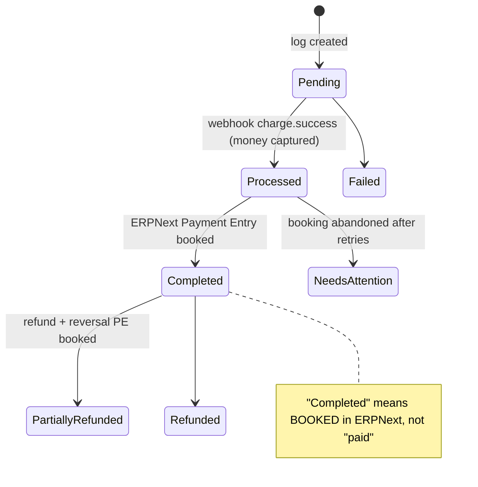
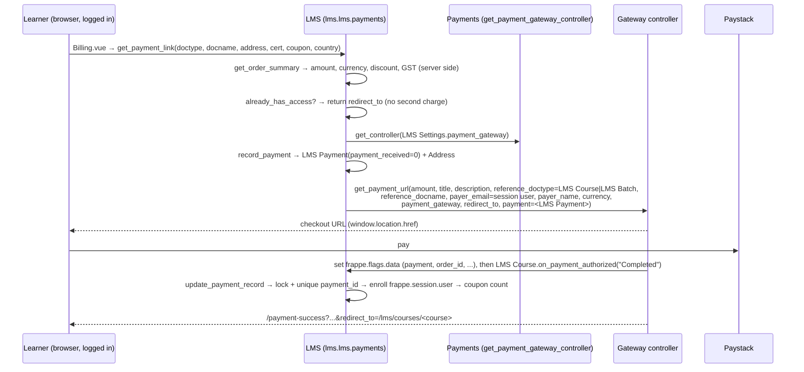
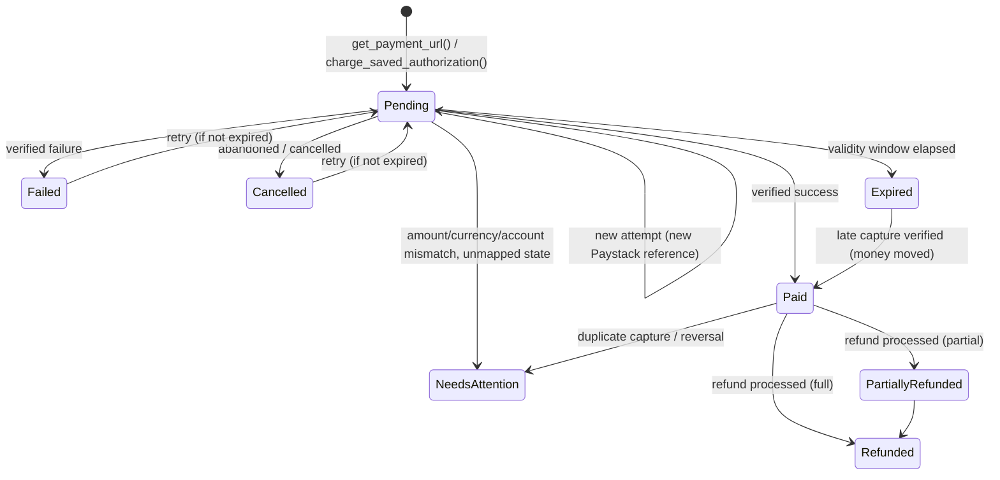
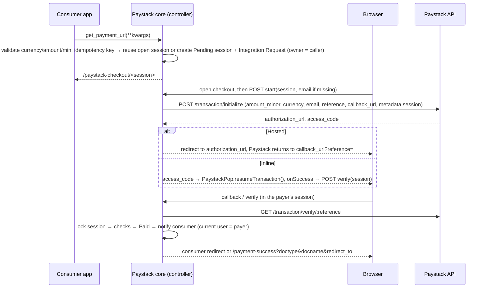
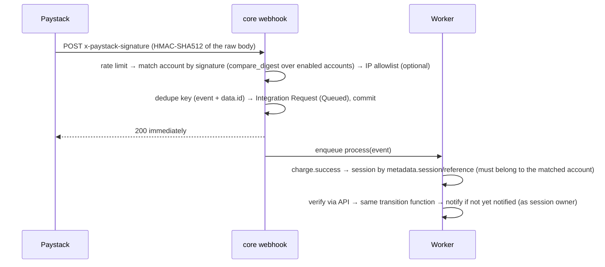
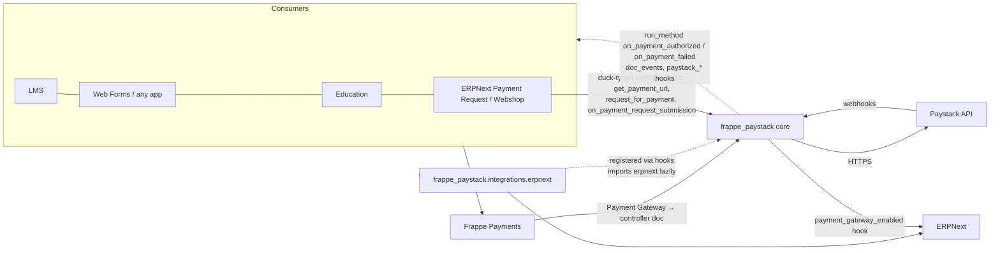

# Paystack for Frappe Payments: Phase 1 analysis (Payments-native refactor)

| | |
|---|---|
| **Status** | Phase 1 analysis, reviewed. **Phase 2 is implemented on this branch.** See the table below, `README.md` and `CHANGELOG.md`. |
| **Date** | 2026-09-25 |
| **Branch** | `arena/01a0d81a-paystack-frappe` @ `d5982d7` (identical to upstream `mymi14s/frappe_paystack` `master`) |
| **Scope** | Deliverables 1 to 17 and the dependency matrix requested in the brief |
| **Evidence** | Source code of every app involved, read at pinned commits (Appendix B), plus an **empirical import test** on Frappe 15.121.1 + Payments v15 **without ERPNext** |

**Decisions as resolved for Phase 2:**

| # | Resolution |
|---|---|
| D1 | Upstream `version-15` (15.5.0) and `version-16` (16.0.0) imported with history, then refactored. |
| D2 | "School" = Education. It requires ERPNext, so it is tested in the ERPNext CI environment. LMS is the no-ERPNext target. |
| D3 | One codebase on this repository's develop line for Frappe version-15 and version-16. CI also runs Frappe develop. |
| D4 | In-app adapter at `frappe_paystack/integrations/erpnext`, with a CI import-boundary check. |
| D5 | Callbacks run as the initiating user on every completion path: browser, webhook, sweep, and desk actions. Admin-login cases are handled: impersonation is recorded; an admin verifying from the desk is never the payer; an admin enrolling by hand is handled idempotently (LMS course) or flagged (LMS batch); System Managers can start a payment on behalf of a user; a payer's email never selects the user. |
| D6 | "Paystack" stays the default gateway. Other accounts can register `Paystack-<name>`. |
| D7 | Webhook Secret kept as an optional override. |
| D8 | ERPNext-only settings are Custom Fields with the 15.x names. |
| D9 | GitHub Actions on MariaDB: core, LMS and ERPNext+Education, plus an upgrade job from 15.5.0. |

Two deviations from §10–§12:
- `linked_doctype`/`linked_docname` keep their names, now typed as Link and Dynamic Link, instead of being renamed. This keeps reports, print formats and customisations working.
- ERPNext-only reports stay in module "Frappe Paystack" but are guarded, rather than moving to a "Paystack ERPNext" module. The Sales Invoice print format is created by the adapter.

How to read this: §0 gives the summary and the decisions needed. §1 to §5 describe the current state. §6 to §13 are the proposal. §14 to §17 cover tests, file plan and risks. Appendix A is the dependency matrix and Appendix B the evidence.

---

## 0. Executive summary

### 0.1 Findings

1. **Baseline mismatch (blocking question).** This repository is upstream `master` from 2022: v0.0.4, 42 files, ~1.1k lines, Frappe v13 era. None of the features the brief asks us to preserve exist in it: saved cards, refunds, POS, Dunning, subscriptions, settlement accounting, reconciliation, reports, customer portal, and the `pyproject.toml` with an ERPNext dependency. They exist only in upstream **`mymi14s/frappe_paystack` `version-15` / `version-16`**: v15.5.0, ~220 files, ~34k lines, ~1,413 test functions. The refactor must start from one of these lineages (Decision D1).
2. **Upstream v15/v16 cannot be installed on a site without ERPNext**, for three independent reasons:
   - `hooks.required_apps = ["erpnext", "payments"]`. Frappe's `install_app` recursively installs every required app, or aborts with "App erpnext not in apps.txt".
   - **33 of its 68 Python modules fail to import** with `ModuleNotFoundError: No module named 'erpnext'`. This was verified empirically (Appendix B). The failures include the **webhook endpoint** (`frappe_paystack.api`), the **gateway settings controller**, the Payment Log and Refund Log controllers, all 5 reports and 8 of 13 patches.
   - `after_install` creates a `Mode of Payment`, a Property Setter on it and `Payment Gateway Account`s, all of which are ERPNext DocTypes.

   Forcing the app onto such a site would also break **every Jinja render and every website page**, because its `jinja.methods` and `update_website_context` hooks point into modules that import ERPNext (§1.5, O1).
3. **The local 2022 code does not run on Frappe ≥ v14 either.** Its settings controller fails to import (`create_payment_gateway` moved from `frappe.integrations.utils` to `payments.utils`; verified). Its webhook has no signature check, the flow only works with ERPNext Payment Requests, and live `user_data_fields` placeholders in `hooks.py` break GDPR data export/deletion site-wide.
4. **Payments offers an informal "v1" gateway contract, not an abstraction.** Its parts are:
   - a `Payment Gateway` record that points to a controller document;
   - `validate_transaction_currency()` and `get_payment_url(**kwargs)`;
   - a Frappe `Integration Request` used as the session log;
   - completion through `reference_doc.run_method("on_payment_authorized", status)` with `frappe.flags.data`;
   - the `/payment-success|failed|cancel` pages;
   - the `payment_gateway_enabled` hook.

   There is **no** refund, webhook, status-query, failure-callback, idempotency, amount-verification, saved-instrument or session DocType abstraction. A real one (PaymentController "v2" + `Payment Session Log`, frappe/payments **PR #192**) is **open and unmerged**. ERPNext `develop` already contains a dormant, fail-closed consumer for it; released ERPNext v15/v16 do not.
5. **The v1 contract is enough for "any Frappe app".** Payments Web Forms, **LMS** (`LMS Course`/`LMS Batch`) and **Education** (`Student Applicant`) all consume it. ERPNext's Payment Request also consumes it, but its `on_payment_authorized` now lives in **Webshop** and returns early for Guest sessions (i.e. webhooks). ERPNext therefore needs an adapter that calls `PaymentRequest.set_as_paid()`. That is the natural adapter boundary.
6. **LMS imposes concrete, verifiable constraints** (§4):
   - Enrollment is created for **`frappe.session.user`**, so completion must run as the learner.
   - `frappe.flags.data` must carry LMS's `payment` kwarg and a **unique `order_id`**, because it is stored in a unique column.
   - `redirect_to` must be honoured.
   - **LMS never calls `validate_transaction_currency`**, so the gateway must validate currency and amount itself.

   Upstream v15 fails two of these today. It would **reject LMS documents** (`Paystack Payment Log.validate_record()` only accepts submitted ERPNext documents with ERPNext statuses), and it **silently rewrites unsupported currencies to NGN** (an INR 5,000 course would be charged NGN 5,000).
7. **"School" is ambiguous and, in its most likely reading, contradicts the brief.** There is no `frappe/school` repository, `frappe/schools` is archived ("merged with ERPNext"), and **`frappe/education` declares `required_apps = ["erpnext"]`** on every maintained branch. A "Frappe + Payments + School without ERPNext" environment therefore cannot exist if School means Education. If it means the "Frappe School" learning site, that runs on LMS, which is already covered (Decision D2).
8. **The target is feasible without inventing Payments APIs:**
   - A **core** that imports only `frappe` and `payments` and implements the v1 contract properly: server-initialised transactions, verify-before-trust, an idempotent state machine, consumer notification that runs as the session owner, and generic refunds and saved cards.
   - An **in-app ERPNext adapter**, registered per reference DocType through hooks, activated by Payments' own `payment_gateway_enabled` hook and Frappe's `after_app_install`, and **never imported by core** (enforced in CI).
   - Existing ERPNext configuration fields keep their fieldnames and data. They move from the standard schema to adapter-owned Custom Fields (§11.3).

### 0.2 Decisions needed before implementation

| # | Decision | Options | Recommendation |
|---|---|---|---|
| D1 | **Baseline code** | A: keep the local 2022 code. B: import upstream `version-15` (and its `version-16` twin) into this repo and refactor it. C: greenfield. | **B.** Only B contains the features to preserve. A cannot run on Frappe ≥ v14. The plan in §15/§16 assumes B. |
| D2 | **What "School" means** | Education (requires ERPNext). "Frappe School" (LMS). Something else. | Test Education only in ERPNext environments. LMS is the no-ERPNext education target. |
| D3 | **Supported versions** | v15 only. v15 + v16. Also develop. | v15 and v16 branches, as upstream does (they differ only in pins/CI). develop on a best-effort basis. |
| D4 | **Adapter packaging** | In-app `frappe_paystack/integrations/erpnext`. Separate `paystack_erpnext` app. | **In-app**, as the brief suggests, with a hard import boundary and a CI guard. A separate app remains a later option. |
| D5 | **User context for consumer callbacks triggered by webhook or sweep** | Session owner. Only user-driven paths. Administrator (upstream). | **Session owner.** It is required for LMS correctness (§6.7). ERPNext booking keeps elevated rights inside the adapter. |
| D6 | **Payment Gateway naming with several Paystack accounts** | Single "Paystack" gateway with company routing (upstream). One Payment Gateway per account (Payments/Mpesa pattern). | **Both.** The default/legacy account keeps the name "Paystack" (existing Payment Gateway Accounts and Payment Requests keep working). Additional accounts become `Paystack-<name>`. |
| D7 | **"Webhook Secret" field** | Keep. Remove. | **Keep as an optional override.** Paystack signs webhooks with the account's *secret key* and has no separate webhook secret. |
| D8 | **Where ERPNext-only settings live** | Adapter Custom Fields on the settings DocType. A separate adapter DocType. | **Custom Fields with the same fieldnames.** Existing data and UX are preserved (§11.3). |
| D9 | **Where install/migrate is verified** | GitHub Actions (MariaDB service). Elsewhere. | **CI.** MariaDB cannot be installed in this sandbox (Appendix B.3). |

---

## 1. frappe_paystack architecture analysis

### 1.1 Two code lineages

| | This repo (= upstream `master`, `d5982d7`) | Upstream `version-15` (`546aa26`) / `version-16` (`9562e6a`) |
|---|---|---|
| Version / date | 0.0.4, 2022-03-29 | 15.5.0, 2026-08-12 |
| Size | 42 files, ~1.1k lines, empty test stubs | ~220 files, ~34k lines (excluding vendored/dist), ~30 test modules / ~1,413 test functions, Cypress + Vitest |
| Frappe target | v13 era (`setup.py`, `six`, `frappe.integrations.utils.create_payment_gateway`) | v15 / v16 (`pyproject.toml`, flit) |
| Declared dependencies | `frappe` only, no `required_apps` | `required_apps = ["erpnext", "payments"]`. Bench dependencies: frappe, erpnext, payments. Python ≥ 3.12 (v15) / 3.14 (v16) |
| Settings DocType | `Paystack Settings`, named by `gateway_name`: live secret/public key, callback URL, IP table | `Paystack Gateway Setting`, named by `gateway`, **one per Company**: keys, webhook secret, test mode, checkout mode, link validity, ERPNext accounts |
| Transaction record | `Paystack Payment Request` (log written after the webhook) | `Paystack Payment Log` (checkout session + capture + accounting state) |
| Other DocTypes | `IP Address Table` | Refund Log, Reconciliation Log, Settlement, Customer Authorization |
| Webhook security | None | HMAC-SHA512 with `compare_digest`, CIDR IP allowlist, global and per-IP rate limits |
| Works without ERPNext | No (Payment Request-only flow), and not on Frappe ≥ v14 at all | No (§3) |
| `version-15` vs `version-16` | n/a | Only `.github/workflows/ci.yml`, `frappe_paystack/__init__.py` and `pyproject.toml` differ |

### 1.2 Local lineage (`d5982d7`): structure and defects

Structure: `api/v1.py` (`get_payment_request`, `webhook`, `verify_transaction`, `create_log`), `www/paystack/pay/` (a Vue 3 inline checkout page plus a second verify path in `webhook.py`), DocTypes `Paystack Settings`, `Paystack Payment Request` and `IP Address Table`, a workspace, and `utils.py` (HMAC/IP helpers that are never used).

| # | Defect | Severity |
|---|---|---|
| L1 | `paystack_settings.py` imports `create_payment_gateway` from `frappe.integrations.utils`. **`ImportError` on Frappe ≥ v14** (verified on 15.121.1), so the settings DocType cannot be used at all. It also imports `razorpay` and `six`, which are not declared. | Blocker |
| L2 | `hooks.py` ships **live** `user_data_fields` placeholders (`"{doctype_1}"`, …). Frappe's personal-data download/deletion iterates them and fails for **every** user on the site. | High |
| L3 | The webhook (guest) does **no signature or IP verification**. It takes the gateway from payload metadata, hard-codes `frappe.get_doc("Payment Request", reference)`, checks the amount but **not the currency**, and uses f-string SQL on Integration Request. | High (security) |
| L4 | The checkout page accepts only `reference_doctype == "Payment Request"`, redirects to ERPNext's `/orders/<name>`, never verifies on the server after success, has a `history.back()` bug and a bare `popAlert` `ReferenceError`, ignores `redirect_to`, and loads Vue/SweetAlert from unpinned CDNs. | High |
| L5 | `get_payment_request` is whitelisted with no permission check and requires Payment Request fields. It computes the amount as `float × 100` and uses the Payment Request name as the Paystack reference, so retries collide ("duplicate reference"). | Medium |
| L6 | `after_insert` creates a stray Payment Gateway named "Paystack Settings" next to the real one. The settings have no test mode, `live_callback_url` is mandatory but unused, and the IP table is unused. | Low |
| L7 | `Paystack Payment Request.order_id` is a Link to ERPNext's `Payment Request`, and `amount` is stored as Data. `.github/workflows/deploy.yml` makes no sense. | Low |
| L8 | `doctype/paystack_settings/data.json` is a committed **test-mode** webhook payload with a customer email, phone, card BIN/last4 and a test `authorization_code`. | Hygiene |

Conclusion: apart from DocType names, nothing here is reusable. Migrating data from this lineage only matters for Frappe v13 sites (Q-list, §17).

### 1.3 Upstream `version-15` architecture

**Component inventory**

| Area | Files | Role |
|---|---|---|
| Settings | `doctype/paystack_gateway_setting` | Per-company Paystack account and Payments controller. `get_payment_url`, `on_payment_request_submission`, `request_for_payment`. Registers **one** Payment Gateway "Paystack" whose `gateway_controller` is *re-pointed* between settings records. |
| Session/transaction | `doctype/paystack_payment_log` (844-line controller) | Checkout link and session (`/paystack-checkout/<name>`), capture data, **ERPNext Payment Entry booking**, retry/back-off sweeps, manual completion. |
| Refunds | `doctype/paystack_refund_log`, `events.py` | Refunds requested from a log or automatically from a credit note. A **reversal Payment Entry** is booked when the refund is Processed. |
| Payouts | `doctype/paystack_settlement`, `utils/settlement.py` | Settlement webhook, then a record, then a **Journal Entry** (bank/fee/suspense), then linkage of transactions and their fees. |
| Reconciliation | `doctype/paystack_reconciliation_log`, `utils/reconciliation*.py`, `utils/scheduled_jobs.py`, `page/paystack_reconciliation` | Compares the Paystack API with the logs (daily, manual, manual override). |
| Saved cards | `doctype/paystack_customer_authorization`, `api.saved_cards / charge_saved_card`, `utils/subscription.py` | Stores reusable authorizations per **Customer**. Charges ERPNext Subscription invoices every day. |
| Core helpers | `utils/utils.py` (739 lines), `utils/__init__.py` | HMAC, IP allowlist, minor units, settings resolution, `initialize_transaction`, `charge_authorization`, `initiate_refund`, `validate_payment`, **plus ERPNext helpers** (party account, rates, customer email, company permission). `utils/__init__.py` re-exports everything. |
| API | `api.py` (953 lines) | Webhook (routes charge/refund/settlement events), payment links, hosted checkout, QR, saved cards, refunds. |
| ERPNext bridges | `utils/payment_request.py`, `utils/pos_payment.py`, `utils/portal.py`, `public/js/*` | Payment Request creation, POS links and realtime updates, portal pay-button state, Sales Invoice/Sales Order/Dunning form actions, Webshop cart guard. |
| Web | `www/paystack-checkout`, `www/my-payments` | Checkout page (Inline = client-initialised popup, Hosted = server-initialised redirect). Customer portal (invoices, payments, refunds, receipts). |
| Reporting | 5 script reports, 3 Jinja print formats, `Paystack Dashboard` workspace, 8 number cards, 2 charts | Operations and accounting views |
| Install/migrate | `setup.py`, `migration.py`, 13 patches (`patches/v15_0`) | Mode of Payment, Property Setter, Payment Gateway (+ Accounts), dashboard widgets, POS fields; patch/job path renames, back-fills |
| Scheduler | cron `*/10` (stuck Payment Entry retries), `hourly_long` (unposted settlements), `daily_long` (reconciliation, subscription collection) | |

**Implemented flows**

- **A. Payment Request (ERPNext):**
  1. ERPNext calls `PR.get_payment_url()`, which calls `PaystackGatewaySetting.get_payment_url()`.
  2. The gateway resolves the PR through to the Sales Order/Invoice it bills (ERPNext logic inside the gateway).
  3. It creates a Payment Log with `payment_request` set and redirects to `/paystack-checkout/<log>`.
  4. The customer pays through the Inline popup or the Hosted redirect.
  5. The `charge.success` webhook is de-duplicated on the transaction id; the log becomes `Processed`.
  6. `notify_payment_authorized` then switches to Administrator and calls `PR.on_payment_authorized` plus `PR.set_as_paid()`, which creates the Payment Entry; the log becomes `Completed`.
- **B. Direct link** (`create_payment_link` for Sales Invoice, Sales Order, Dunning or any document with `company` and totals):
  1. A Payment Log is created; the webhook marks it `Processed`.
  2. `on_update` enqueues `create_payment_entry_from_log`, which books a Payment Entry into the suspense account using the gateway's Mode of Payment; the log becomes `Completed`.
  3. A back-off sweep retries, and moves the log to `Needs Attention` after 12 attempts or 7 days.
- **C. POS:** "Phone" mode goes through ERPNext PR, then `request_for_payment`, then a realtime checkout URL on the till. "Send link" creates a Payment Log for the draft POS Invoice, sends an email and pushes realtime "paid" events.
- **D. Saved cards / subscriptions:** `capture_authorization` runs on success; `charge_saved_card` charges a stored card; a daily job charges subscription Sales Invoices.
- **E. Refunds:** `initiate_refund_from_log`, or a credit note when `auto_refund_on_credit_note` is set, creates a Refund Log (`Processed`), then a reversal Payment Entry (`Completed`). Refund webhooks update the log.
- **F. Settlement:** the `settlement.*` webhook creates a Paystack Settlement, then a Journal Entry, then transaction linkage.
- **G. Reconciliation:** a daily engine compares `GET /transaction/{id}` or `/transaction/verify/{ref}` with each log.

**Status model: gateway state and accounting state are conflated**



Without ERPNext, a paid log can never leave `Processed`, and a refund can never reach `Completed` (the Refund Log only becomes `Completed` after a reversal Payment Entry is booked). The generic model in §6 separates gateway state from the consumer's bookkeeping state, which is also what Payments PR #192 converged on (`status` vs `reconciliation`).

### 1.4 Responsibility classification (upstream code)

| Responsibility | Upstream location | Target | Notes |
|---|---|---|---|
| Credentials, test mode, key-mode validation | Gateway Setting | **Core** | |
| Payment Gateway registration + `payment_gateway_enabled` hook | Gateway Setting / `setup.py` | **Core** | ERPNext creates its Payment Gateway Account from this hook by itself |
| Company ↔ account routing, suspense/fee/bank accounts, Mode of Payment | Gateway Setting, `setup.py` | **Adapter** | |
| Currency support, minor units, minimum amounts | `utils.utils` | **Core** | Remove the NGN fallback; add XOF and minimums |
| Session/link creation, expiry, checkout page | Payment Log, `www/paystack-checkout`, `api.start_hosted_checkout` | **Core** (generic context) | ERPNext display fields come from the adapter |
| Payability of the business document (outstanding, ERPNext statuses) | `PaymentLog.validate_record/is_payable` | **Adapter** (per reference DocType) | The generic default is "session not paid and not expired" |
| Transaction initialise/verify/charge_authorization/refund API calls | `utils.utils`, `utils.reconciliation` | **Core** (`PaystackClient`) | |
| Webhook: signature, IP, rate limit, dedupe, routing | `api.paystack_webhook` | **Core** | |
| Status transitions of the capture | `api._handle_charge` | **Core** | |
| Notify the consumer (`on_payment_authorized`) | `api.notify_payment_authorized` (Payment Request only) | **Core** (any reference) | For Payment Request, the adapter adds `set_as_paid()` |
| Payment Entry / reversal / Journal Entry booking, retries | Payment Log, Refund Log, `utils.settlement` | **Adapter** | |
| Refund money movement and status | Refund Log, `api`, `utils.initiate_refund` | **Core** | Credit-note automation stays in the adapter |
| Saved authorizations storage/charging | Customer Authorization, `api` | **Core** (generic payer) | Customer binding and subscription collection stay in the adapter |
| Gateway-vs-local reconciliation | `utils.reconciliation*` | **Core** | Ledger-level checks go to the adapter |
| Settlement facts (payouts, fees per transaction) | `utils.settlement` | **Core** | Journal Entry goes to the adapter |
| Customer portal, pay-button state, Webshop guard, form buttons, POS UI | `utils.portal`, `www/my-payments`, `public/js/*` | **Adapter** | |
| Receipts (payment/refund), QR/payment-link Jinja helpers | print formats, `utils.printing/qr` | **Core** | The Sales Invoice print format moves to the adapter |

### 1.5 Correctness and security observations

| # | Observation | Lineage | Evidence |
|---|---|---|---|
| O1 | **Forcing the app onto a no-ERPNext site breaks the whole site.** `update_website_context` runs on every template page. `jinja.methods` is loaded by `get_jinja_hooks()`: the first `ModuleNotFoundError` is caught, but the `frappe.get_attr()` fallback re-raises it. Both hooks import `frappe_paystack.utils.*`, which imports ERPNext. | v15 | `frappe/website/page_renderers/base_template_page.py`, `frappe/utils/jinja.py` (v15) |
| O2 | **Silent currency coercion.** `normalize_currency()` maps any unsupported code to `"NGN"`. `PaymentLog.validate()` applies it, and `get_payment_url` never calls `validate_transaction_currency` itself (ERPNext does, LMS and Web Forms do not). An INR or EUR request is recorded and charged as NGN with the same number. | v15 | `utils/utils.py:256`, payment log `validate()` |
| O3 | **Only ERPNext documents can be paid.** `validate_record()` requires `docstatus == 1` and an ERPNext status (Unpaid, To Bill, Unresolved, …). `get_data()` reads `order.customer`, `conversion_rate` and `currency`. `LMS Course` and `Web Form` documents are rejected. | v15 | payment log `validate_record`, `get_data` |
| O4 | **Inline mode lets the client set amount and currency** (`PaystackPop.newTransaction`). Outside the Payment Request path, the charge handler books `amount_paid` without comparing it to the expected amount. Server-side initialisation plus `resumeTransaction(access_code)` removes this class of issue. | v15, local | `public/js/paystack_checkout.js` |
| O5 | **Completion depends only on the webhook.** The Inline `onSuccess` handler only changes the UI and ignores `redirect_to`. When the webhook is late or unreachable (e.g. a local development site), the log stays `Pending`. | v15 | same |
| O6 | **Payment Request completion runs as Administrator** (`frappe.set_user("Administrator")`). That is right for accounting, but wrong for session-dependent consumers such as LMS (§4). | v15 | `api.notify_payment_authorized` |
| O7 | One Payment Gateway "Paystack" is shared across companies, and its controller is re-pointed at runtime (`for_company`, `repoint_payment_gateway_controller`). This is fragile, and generic callers cannot express it. | v15 | Gateway Setting, `setup.py` |
| O8 | The settings form's "Test Signature" button only re-reads the document. It tests nothing. | v15 | `paystack_gateway_setting.js` |
| O9 | XOF is missing from `SUPPORTED_CURRENCIES` and there is no minimum-amount check. Paystack documents NGN ₦50, USD $2, GHS ₵0.10, ZAR R1, KES Ksh 3 and XOF 1 (whole units, still ×100). | v15 | [Paystack API: supported currency](https://paystack.com/docs/api/#supported-currency) |
| O10 | The settlement handling relies on `settlement.success` / `settlement.processed` events, which are **not in Paystack's documented webhook event list**. | v15 | [Paystack webhooks: supported events](https://paystack.com/docs/payments/webhooks/#supported-events) |
| O11 | ERPNext roles (`Accounts Manager`, `Accounts User`) are hard-coded in DocType permissions and code checks. Frappe auto-creates missing roles, so this does not fail, but it is ERPNext semantics inside the generic core. | v15 | DocType JSONs, `reconciliation_api.py` |

---

## 2. Payments architecture analysis

Analysed at `develop` (`86fefa9`), `version-15` (`9885a6e`) and `version-16` (`cca07d9`). The public helpers are **functionally identical across all three**; `develop` only adds Razorpay refunds and a refund webhook (#248, #251). None of the branches declare `required_apps` or depend on ERPNext. Payments' own gateways **import cleanly without ERPNext** (verified, Appendix B).

### 2.1 Inventory

| Piece | What it is |
|---|---|
| `Payment Gateway` DocType (`payments/payments/doctype/payment_gateway`) | Fields `gateway` (name), `gateway_settings` (Link DocType), `gateway_controller` (Dynamic Link). The controller class has no methods. System Manager only. |
| `payments.utils` | `create_payment_gateway(gateway, settings=None, controller=None)`, `get_payment_gateway_controller(gateway)`, `get_checkout_url(**kwargs)` (guest), `erpnext_app_import_guard()`, Web Form custom fields install/uninstall |
| `overrides/payment_webform.py` | `extend_doctype_class` for Web Form. "Accept Payment" Web Forms call `controller.get_payment_url(...)` after submission. |
| `templates/pages/payment-success`, `payment-failed`, `payment-cancel` | Result pages. Success calls `doc.get_payment_success_message()` if it exists and follows `redirect_to`. Cancel marks the Integration Request (`token`) as Cancelled. |
| Gateway settings DocTypes | Razorpay, Stripe, PayPal, Braintree, Paytm, GoCardless, Mpesa, Paymob: each implements the contract below by duck typing |

### 2.2 The de-facto v1 contract (derived from code, not documentation)

| Step | Caller → callee | Signature / behaviour | Source |
|---|---|---|---|
| Registration | gateway → Payments | `create_payment_gateway(name, settings, controller)`. Single settings DocTypes pass only `name` (`"{name} Settings"` is implied). Named (multi-account) ones pass `settings` + `controller`. | `payments/utils/utils.py` |
| Enablement broadcast | gateway → anyone | `call_hook_method("payment_gateway_enabled", gateway=name[, payment_channel=…])`. **ERPNext subscribes** (`erpnext.accounts.utils.create_payment_gateway_account`) and creates a bank account plus a Payment Gateway Account for the default company. | ERPNext `hooks.py` (v15, v16, develop) |
| Resolution | consumer → Payments | `get_payment_gateway_controller(name)` returns `frappe.get_doc(gateway_settings, gateway_controller)`, or the Single `"{name} Settings"` | `payments.utils` |
| Currency check | consumer → controller | `validate_transaction_currency(currency)`. ERPNext calls it unconditionally. **Web Forms and LMS do not call it.** | ERPNext `payment_request.py` |
| Optional checks | ERPNext → controller | `validate_minimum_transaction_amount(currency, amount)` and `on_payment_request_submission(pr)` (both called only if present); `request_for_payment(**kwargs)` (Phone channel) | same |
| Checkout URL | consumer → controller | `get_payment_url(**kwargs) -> str`. The kwargs actually used are `amount, title, description, reference_doctype, reference_docname, payer_email, payer_name, order_id, currency, redirect_to, payment_gateway`, **plus arbitrary extras** (LMS: `payment`; Razorpay: `subscription_details`). | Web Form override, ERPNext PR, LMS |
| Session record | controller → Frappe | `frappe.integrations.utils.create_request_log(kwargs, service_name=…)` creates an **Integration Request** with `reference_doctype/docname` taken from the kwargs, `data` = the kwargs as JSON, `owner` = the current user, and status `Queued/Authorized/Completed/Cancelled/Failed` | Frappe `integration_request` (same fields and methods on v15, v16 and develop; v16+ adds `response_headers`) |
| Completion | controller → consumer | `frappe.flags.data = <session data>` then `frappe.get_doc(reference_doctype, reference_docname).run_method("on_payment_authorized", status)`. Status is one of `Authorized`, `Completed`, `Verified`. `run_method` also dispatches **`doc_events[doctype]["on_payment_authorized"]`** from every app, plus notifications, webhooks and server scripts. A string return value becomes the redirect URL (dict returns are merged). | Razorpay/Stripe/Braintree/PayPal/Paymob; Frappe `document.py` |
| Redirect | controller → browser | `/payment-success?doctype=&docname=&redirect_to=` or `/payment-failed` | all gateways |

**Consumers of this contract today:** Payments Web Forms; LMS (`LMS Course`, `LMS Batch`); Education (`Student Applicant`); ERPNext (`Payment Request`, whose `on_payment_authorized` is provided by **Webshop** through `override_doctype_class`).

### 2.3 Multi-account pattern

Mpesa stores one named settings record per account and registers **one Payment Gateway per record** (`"Mpesa-" + name`, `settings="Mpesa Settings"`, `controller=name`). This is the Payments-native way to run several Paystack accounts. In ERPNext, each company then picks its gateway through its own Payment Gateway Account, and in LMS the admin picks one in LMS Settings. Limitation: `payments.utils.get_checkout_url` (a guest endpoint) only resolves **Single** `"{gateway} Settings"` DocTypes.

### 2.4 Payments' own "ERPNext optional" patterns (which we should mirror)

- Conditional customisations: `make_custom_fields()` adds a Customer field to `GoCardless Mandate` only `if "erpnext" in frappe.get_installed_apps()`. Mpesa adds POS fields the same way.
- Lazy imports: `with erpnext_app_import_guard(): from erpnext import …` sits inside functions, never at module level.
- Hooks instead of imports: gateways call `payment_gateway_enabled`, and ERPNext reacts.

### 2.5 Refunds, webhooks and subscriptions in Payments

- **Refunds:** Razorpay-only controller methods (`refund_payment(payment_id, amount=None)`, `fetch_refund`, `fetch_refunds`, `fetch_payment`) and a signature-verified refund webhook (develop). The webhook logs an Integration Request (de-duplicated on `X-Razorpay-Event-Id`) and calls **`call_hook_method("handle_refund_notification", doctype, docname)`**. **ERPNext does not subscribe to it on any branch**, and the payload is gateway-specific. There is no cross-gateway refund abstraction.
- **Subscriptions:** Razorpay/PayPal-specific, using the `handle_subscription_notification` hook, which ERPNext also does not subscribe to.
- **Webhooks:** each gateway writes its own. There is no shared framework.

### 2.6 PaymentController "v2" (frappe/payments PR #192), not merged

- **Status:** open, last updated 2026-09-09 (head `nlvegan/payments@151b7f4`), flagged ready for the merge queue. It revives #53 (closed 2023).
- **Content:** a `PaymentController` base class (`initiate(tx_data, gateway) → psl_name`, `get_payment_url(psl_name)`, `proceed`, `process_response`). A **`Payment Session Log`** state spine with `status` (Created, Started, Initiated, Data Capture, Paid, Authorized, Processing, Declined, Error, Unresolved) kept **separate from** `reconciliation` (Pending/Done/Failed). A `/pay` page, `Payment Button`, `payments/types.py` (`TxData`, …) and `is_v2_gateway()`. RefDoc hooks `on_payment_charge_processed(changed, state, flags, flowstates)` and `on_payment_failed(message)`.
- **ERPNext side:** ERPNext `develop` already contains `_is_v2_gateway()` / `_process_v2_gateway()` in `payment_request.py` (verified, merged as erpnext#51723). They fail closed when Payments lacks the modules. **ERPNext v15/v16 do not contain them.**
- **Implications for us:**
  1. Do not depend on v2.
  2. Do not *look* like a v2 gateway, so that `is_v2_gateway()` returns False until we implement it.
  3. Shape the core so it maps onto v2 (session = PSL, attempt initialisation = `_initiate_charge`, verification = `_process_response_for_charge`, consumer notification = `on_payment_charge_processed`), and reuse its failure hook name `on_payment_failed`.

### 2.7 Weaknesses in Payments to avoid

Razorpay's guest `make_payment` takes `reference_doctype/reference_docname` **from the client** and calls `on_payment_authorized` on them without checking the amount. Our design always derives the reference, amount and currency from server-side session state.

---

## 3. Complete ERPNext dependency map (upstream `version-15`)

Of 104 non-test source files, 62 reference ERPNext concepts. Categories:

### 3.1 Install/import blockers

| Blocker | Where | Effect without ERPNext |
|---|---|---|
| `required_apps = ["erpnext", "payments"]` | `hooks.py` | `install-app` installs ERPNext or aborts (`frappe/installer.py: install_app` recursion) |
| `[tool.bench.frappe-dependencies] erpnext` | `pyproject.toml` | bench resolves and pins ERPNext |
| Module-level `import erpnext` (5 direct importers, **33 of 68 modules broken**) | see 3.2 | Webhook, settings form, logs, reports and patches cannot load |
| `after_install` → `ensure_mode_of_payment`, `ensure_email_payment_type` (Property Setter on `Mode of Payment.type`), `create_payment_gateway_accounts_for_existing_settings` | `setup.py` | Install crashes after the app is already in `installed_apps` (a half-installed state) |
| Mandatory Link fields to ERPNext DocTypes (`company`, `suspense_account`, `mode_of_payment`, `customer`) | DocType JSONs | The DocTypes *sync* (Frappe imports DocType JSON with `ignore_links/ignore_validate`), but **no record can be saved**. A non-empty Link triggers `frappe.get_meta("Company")`, which fails. |
| `jinja.methods`, `update_website_context` pointing at ERPNext-importing modules | `hooks.py` | Every Jinja render and website page fails (O1) |

### 3.2 Python imports (empirically confirmed)

| Direct importer | ERPNext symbol |
|---|---|
| `utils/utils.py` | `erpnext.accounts.party.get_party_account` (and `utils/__init__.py` re-exports the module, so **any** `frappe_paystack.utils.*` import fails) |
| `utils/payment_request.py` | `erpnext...payment_request.make_payment_request` |
| `utils/portal.py` | `erpnext...payment_request.get_amount` |
| `doctype/paystack_payment_log/paystack_payment_log.py` | `erpnext...payment_entry.get_payment_entry` |
| `doctype/paystack_refund_log/paystack_refund_log.py` | `erpnext...payment_entry.get_payment_entry` |
| `tests/session_setup.py` | `erpnext.setup.utils`, `erpnext.tests.utils` |

Transitively broken (33): `api`, `events`, `migration`, the `utils` package and **all 12** `utils.*` submodules (even the generic `utils.qr` and `utils.printing`, because importing any submodule first runs `utils/__init__.py`), Gateway Setting, Payment Log and Refund Log controllers, 5 reports, `www/my-payments`, and 8 of 13 patches.

### 3.3 ERPNext DocTypes referenced

| DocType | Used for | Target |
|---|---|---|
| Company | settings routing, log scoping, currency check, cost centre, permissions | Adapter (Custom Field + resolver) |
| Account | suspense, settlement bank and fee accounts; party accounts | Adapter |
| Mode of Payment (+ Property Setter on `type`) | Payment Entry mode, POS tender | Adapter setup |
| Payment Gateway Account | per-company gateway account, POS channel | Adapter setup (ERPNext also creates one itself through `payment_gateway_enabled`) |
| Payment Request | checkout for Sales Order/Invoice, POS Phone, `set_as_paid`, back-fill | Adapter (`payment_request.py`) |
| Payment Entry / Payment Entry Reference | booking, reversal, lookup | Adapter |
| Journal Entry, GL Entry | settlement booking and report | Adapter |
| Sales Invoice / Sales Order / Dunning | payable documents, form actions, credit notes, subscription invoices | Adapter |
| POS Invoice, POS Settings, POS Field | POS link, fields, phone payments | Adapter |
| Customer (+ Contact/Dynamic Link lookups) | payer identity, email, saved cards, portal ownership | Adapter (core uses payer email / User) |
| Subscription (`Sales Invoice.subscription`) | auto-collection | Adapter |
| Accounts Settings | tests only | Adapter tests |

### 3.4 Fields read from business documents

`customer`, `company`, `currency`, `conversion_rate`, `outstanding_amount`, `grand_total`, `base_grand_total`, `advance_paid`, `status`, `docstatus`, `is_return`, `return_against`, `subscription`, `debit_to` (via `get_party_account`), `contact_email`, `payments[].mode_of_payment/type/amount` (POS), `email_to`, `make_sales_invoice` (v16 PR). All of these move behind adapters. Core only reads the session's own fields and the v1 kwargs.

### 3.5 Roles

`Accounts Manager` and `Accounts User` appear in 5 DocType permission sets, 5 reports, the reconciliation page and `reconciliation_api` role checks. `check_gateway_role` gates money-moving actions. Target: core relies on DocPerms (System Manager by default, or an app role, see Q7), and the adapter adds Accounts roles as Custom DocPerms.

### 3.6 Hooks

| Hook | Target |
|---|---|
| `required_apps` | `["payments"]` |
| `after_install` | core install; the adapter activates only if ERPNext is present |
| `before_tests` (runs the ERPNext setup wizard) | split: core fixtures without ERPNext, plus an ERPNext fixture used only by adapter tests |
| `app_include_js` (`paystack_actions` = SI/SO/Dunning actions, `paystack_pos`) | adapter assets (hooks stay static; the code is inert without the DocTypes) |
| `web_include_js` (Webshop cart guard) | adapter asset (inert without `#pay-for-order`) |
| `doctype_js` Sales Invoice / Sales Order / Dunning | adapter JS |
| `doc_events` Sales Invoice `on_submit` (credit-note auto refund) | adapter module (doc_events are imported lazily, only when the event fires) |
| `has_website_permission` Paystack Payment Log | core dispatcher (owner/payer) plus adapter (customer ownership) |
| `update_website_context` (hide pay buttons) | adapter behind an import-safe core dispatcher |
| `scheduler_events`: `*/10` Payment Entry retries, `hourly_long` settlement Journal Entry retries, `daily_long` reconciliation + subscription collection | the adapter's guarded jobs; reconciliation stays in core |
| `website_route_rules` `/paystack-checkout/<reference>` | core (the URL is kept) |
| `jinja.methods` payment link / QR | core (import-safe) |

### 3.7 Whitelisted endpoints (21)

| Endpoint | Guest | Target |
|---|---|---|
| `api.paystack_webhook` | yes (rate limited) | **Core**, same dotted path (URLs are configured in Paystack dashboards) |
| `api.validate_payment_link`, `api.start_hosted_checkout` | yes | Core, generic |
| `api.payment_link_qr` | no | Core |
| `api.initiate_refund_from_log`, `paystack_payment_log.validate_payment` | no | Core (permission through DocPerm) |
| `api.create_payment_link` | no | Adapter; old path becomes a shim. Core gets a *server-side* API (§9.4). |
| `api.is_enabled_for_company`, `api.saved_cards`, `api.charge_saved_card`, `utils.get_customer_email` | no | Adapter; old paths become shims. Core exposes generic saved-card APIs. |
| `paystack_payment_log.complete_payment` (manual Payment Entry booking) | no | Adapter |
| `paystack_refund_log.send_refund_receipt` | no | Core (sent to the payer email); the adapter supplies the customer email |
| `utils.portal.download_payment_receipt` | no | Adapter (customer ownership); core has an owner/payer variant |
| `utils.pos_payment.send_pos_payment_link`, `pos_payment_status` | no | Adapter (old paths become shims) |
| `utils.reconciliation_api.*` (5) | no | Core; company scoping comes from the adapter |

### 3.8 Routes and front end

- **Portal routes:** `/my-payments` is an ERPNext customer portal. The code also hard-codes ERPNext's `/orders` and `/invoices` and Webshop's `pay-for-order`, `show_pay_button` and `enabled_checkout`. All of this goes to the adapter.
- **Checkout JS:** the Inline checkout displays ERPNext fields (customer, order, exchange rate). This becomes a generic display, with extra rows supplied by adapters.
- **Desk JS:** POS request handler override, Sales Invoice/Order/Dunning buttons, Customer email lookups. All of this goes to the adapter.

### 3.9 Standard records

| Record | ERPNext-bound? | Target |
|---|---|---|
| Report *Paystack Transactions* | light (Customer column) | Core, generalised |
| Report *Paystack Activity* | partial (Payment Entry column) | Core, plus adapter columns |
| Reports *Customer Paystack Volume*, *Paystack Unsettled Payments*, *Paystack Settlements vs Ledger* | yes (Customer/SI/SO, Payment Entry, Journal Entry/GL) | Adapter module "Paystack ERPNext" |
| Print formats *Paystack Payment Receipt*, *Paystack Refund Receipt* | no | Core |
| Print format *Paystack Invoice with Payment Link* | yes (Sales Invoice fields) | Adapter module |
| Number cards *Awaiting Settlement* (`payment_entry` not set), *Payouts Not Booked* (`journal_entry`), *Needs Attention* | yes | Adapter |
| The other 5 number cards, 2 charts, the reconciliation page, the workspace | no | Core; the workspace gets adapter links |

### 3.10 Patches and tests

- **Patches:** 8 of 13 patches fail to import without ERPNext. `backfill_payment_request` and `route_payments_per_company` operate on Payment Request and Payment Gateway Account data. Fresh installs mark every patch as completed without importing it (`set_all_patches_as_completed`), so these only matter on upgrades. They must become import-safe and be skipped when ERPNext is absent.
- **Tests:** every upstream test bootstraps ERPNext (setup wizard, `_Test Company`, chart of accounts). No test can run without ERPNext.

### 3.11 Local lineage (`d5982d7`): ERPNext dependencies

There are no module-level ERPNext imports. The dependencies are data-level: `api/v1.get_payment_request` and `webhook` require a `Payment Request`; `Paystack Payment Request.order_id` links to `Payment Request`; the checkout page only accepts Payment Requests and redirects to `/orders/<name>`.

---

## 4. LMS payment-flow analysis

Analysed at `frappe/lms` `develop` (`aae024f`) and `version-15` / `version-16` (both `87168fc`, 2026-09-10). The behaviour below is identical on all of them. `hooks.required_apps = ["frappe/payments"]` holds on develop, main, version-15 and version-16, so **LMS requires Payments but not ERPNext**, which makes it the primary no-ERPNext validation target.

### 4.1 Flow



### 4.2 Answers to the brief's questions

| Question | Answer (code) |
|---|---|
| How LMS creates a payable transaction | `lms/lms/payments.py:get_payment_link` (whitelisted, **login required**). Prices come from `get_order_summary` (course/batch price and currency, coupon, GST for INR, USD equivalent for exception countries). |
| How the payment object is created | `record_payment` inserts an **`LMS Payment`** (member, amount, currency, discount, GST, coupon, `payment_for_document_type/document`, `payment_for_certificate`, `payment_received=0`) and upserts the learner's billing `Address`. The gateway-side object is whatever the controller creates. LMS reads Integration Requests only as a fallback. |
| How LMS reaches checkout | It calls `controller.get_payment_url(**payment_details)` directly and returns the URL; `Billing.vue` does `window.location.href = data`. **LMS never calls `validate_transaction_currency`.** |
| Gateway selection | `LMS Settings.payment_gateway` is a **Data** field holding a Payment Gateway name, resolved with `payments.utils.get_payment_gateway_controller`. LMS's "Settings → Payment Gateways" UI offers only DocTypes in module **"Payment Gateways"** (Payments' own module) whose names end with " Settings". An external Paystack DocType is configured in Desk and then selected by name. |
| Completion callback | `LMS Course.on_payment_authorized(status)` / `LMS Batch.on_payment_authorized(status)`, acting only when `status in ["Authorized", "Completed"]`. The payment is found through `frappe.flags.data["payment"]`, or else the **latest Integration Request for the course/batch with `owner = frappe.session.user`**. |
| Marking enrollment paid | `update_payment_record` → `payment_already_recorded` (a `for_update` row lock plus a **unique** `LMS Payment.payment_id`) → `update_payment_details` (`payment_received=1`, `payment_id = data[get_payment_id(data)]`, which is **`order_id`** for gateways other than Razorpay and Stripe) → `complete_enrollment` → `enroll_in_course` / `enroll_in_batch` / `update_certificate_purchase` **for `frappe.session.user`** → coupon redemption (row-locked). |
| Success | Whatever redirect the gateway returns. With Payments' success page, "Continue" is shown and the browser auto-redirects to `redirect_to` (the course, batch or certification page). |
| Failure | No LMS hook. The `LMS Payment` stays unpaid, and a scheduler (`send_payment_reminder`) may email reminders if enabled. |
| Refresh / back button | Calling `get_payment_link` again short-circuits on `already_has_access`. |
| Retry | Each click creates a **new** `LMS Payment` and a new gateway session. Unpaid rows remain. |
| Webhooks | **None in LMS.** It relies on the gateway calling `on_payment_authorized` in the learner's session. |
| Anonymous users | Not supported (no `allow_guest`; the Billing page asks guests to log in). |
| Currency / amount | Major-unit float from the course/batch. It can be `0`, in which case the enrollment completes without a gateway. Any currency is possible (the default is `LMS Settings.default_currency`; INR is common). |

### 4.3 Constraints LMS places on the Paystack gateway

| # | Constraint | Consequence for our design |
|---|---|---|
| C1 | Enrollment uses `frappe.session.user` | Consumer notification must run **as the learner**: synchronously in the user-driven verify/callback request, or, when triggered by a webhook or sweep, with the session owner temporarily set as the user (D5). |
| C2 | `frappe.flags.data` must contain `payment` (and `payment_gateway`) | Store the complete original kwargs on the session and restore them as `frappe.flags.data` before `run_method`. |
| C3 | `order_id` from `frappe.flags.data` is stored in the unique `LMS Payment.payment_id` | Set `order_id` to the Paystack reference **if the caller did not supply one** (LMS never does). It is unique per session. |
| C4 | Fallback lookup: Integration Request by (reference, `owner`) | Create the session's Integration Request inside the caller's request (the owner is then the learner) with reference = the course/batch. `create_request_log(kwargs)` already does this. |
| C5 | `redirect_to` must be honoured | Redirect to `/payment-success?...&redirect_to=` unless the consumer returns a URL. |
| C6 | LMS skips the currency check | `get_payment_url` validates currency, minimum amount and precision itself and fails with a clear message (no NGN fallback). |
| C7 | Repeated callbacks must stay idempotent | LMS is idempotent, but notify at most once per session anyway (row lock plus `notification_status`). |
| C8 | Status string | Pass `"Completed"`. Paystack captures immediately; there is no separate authorisation step for card checkouts. |

**LMS-side gaps** (upstream-able to LMS, not our code): the gateway picker filters on the module "Payment Gateways"; `get_payment_id` evaluates `"Stripe" in payment_gateway`, which raises if `payment_gateway` is missing (our data always includes it); there is no failure or refund handling.

---

## 5. School payment-flow analysis

### 5.1 Which app is "School"?

| Candidate | Finding |
|---|---|
| `frappe/school` | **Does not exist** (GitHub: "Could not resolve to a Repository"). |
| `frappe/schools` | Archived; description "Merged with frappe/erpnext – this repo is deprecated". |
| `frappe/education` | "Open source education / school management system". **`required_apps = ["erpnext"]`** on `develop` (`c9d3006`), `version-16` and `version-15.2`, and it imports ERPNext in 17 places. |
| "Frappe School" (school.frappe.io) | Frappe's learning site. To our understanding it runs on **LMS**, so it would be covered by §4 (unverified; Q2). |

**Contradiction with the brief:** if School means Education, then "Frappe + Payments + School" *without ERPNext* is not an installable environment. We propose testing Education only as ERPNext + Education (E4 in §14) and using LMS as the no-ERPNext education target.

### 5.2 Education payment flows

1. **Student Applicant (generic v1 contract).**
   - Education defines `StudentApplicant.on_payment_authorized(*args, **kwargs)` → `db_set("paid", 1)`.
   - No shipped Web Form enables `accept_payment`. Payment happens when an administrator configures a Payments "Accept Payment" Web Form on Student Applicant: `PaymentWebForm.get_payment_gateway_url(doc)` → `controller.get_payment_url(reference_doctype="Student Applicant", …)`.
   - Guests may submit such forms (Payments passes `payer_email = frappe.session.user`, which can be "Guest"). **Anonymous checkout is therefore a real requirement.**
   - This flow needs only the generic core, even though ERPNext happens to be installed.
2. **Fees (ERPNext path).** `Fees` → `make_payment_request` → ERPNext Payment Request (ERPNext's `PR.get_payment_url` special-cases `Fees`) → the Paystack controller with `reference_doctype="Payment Request"` → handled by the ERPNext adapter's Payment Request path.

---

## 6. Proposed generic lifecycle

### 6.1 Principles

1. **The consumer owns the business transaction.** The gateway stores the consumer's reference (`reference_doctype/reference_docname`) and the opaque kwargs, and never interprets them.
2. **Server-initialised transactions only.** Hosted mode redirects to `authorization_url`. Inline mode calls `resumeTransaction(access_code)` (Paystack InlineJS v2). The browser never sets the amount, currency or reference.
3. **Verify before trust.** Every success path (callback, inline verify, webhook, sweep) ends in the same function. It verifies with `GET /transaction/verify/:reference` (or `/transaction/:id`), checks reference, account, amount (minor units), currency and status, and then transitions.
4. **One state machine, one transition function, row-locked.** Transitions are idempotent. `transaction_id` is unique.
5. **Gateway state is separate from consumer state.** `status` records what Paystack did. `notification_status` records whether the consumer was told. ERPNext booking state lives only in the adapter.
6. **Never silently change currency or amount.**

### 6.2 Entities

| Entity | DocType | Notes |
|---|---|---|
| Payment session | **`Paystack Payment Log`** (name kept for compatibility; generalised) | Name = random hash, which is the capability for `/paystack-checkout/<name>`. It holds expected amount/currency, reference, payer, original kwargs, account, status, notification state, capture data and expiry. |
| Attempt | Integration Request rows (`request_id` = Paystack reference) | Each initialise creates a new attempt with reference `<session>` for the first and `<session>-<n>` after that. The current reference is stored on the session, and `metadata.session` points back. |
| Refund | `Paystack Refund Log` (generalised) | Asynchronous (`refund.pending/processing/processed/failed`) |
| Saved instrument | `Paystack Customer Authorization` (generic payer) | Identified by payer email + `customer_code` + signature; optional party link |
| Raw event | Integration Request (`integration_request_service="Paystack"`, `is_remote_request=1`, `request_id`=dedupe key) | Audit log and dedupe, the same approach as Razorpay's webhook |
| Payout | `Paystack Settlement` (generalised) | Facts only; accounting belongs to the adapter |

### 6.3 Session state machine



| Paystack transaction status | Session transition |
|---|---|
| `success` + checks pass | → `Paid` |
| `success` + a check fails | → `Needs Attention` (no consumer notification; error log + alert) |
| `failed` | → `Failed` (`on_payment_failed`) |
| `abandoned` | → `Cancelled` |
| `reversed` | → `Needs Attention` (and an event for adapters) |
| in-progress states (`ongoing`, `pending`, `processing`, `queued`, …) | stay `Pending`; the sweep re-verifies later |

`notification_status` (independent): `Pending` → `Notified` | `Failed` (retried with back-off by the sweep) → `Needs Attention` after N attempts.

### 6.4 Sequences

**Hosted or inline checkout, user-driven completion**



**Webhook (server to server, backup and source of truth)**



**Refund**: `refund_payment(session, amount, reason, reference)` → validate the refundable balance (paid − processed − pending) → `POST /refund` → Refund Log `Pending` → `refund.*` webhook or poll → `Processed` / `Failed` → session totals and status → hook `paystack_refund_updated` (the ERPNext adapter books the reversal Payment Entry).

### 6.5 Verification rules

| Check | Rule |
|---|---|
| Reference | `data.reference` must be an attempt reference of this session. `metadata.session` must equal the session name. |
| Account | The account matched by the webhook signature (or the session's account for verify calls) must equal `session.gateway_setting`. |
| Status | Only `success` means paid (the top-level `status: true` only means the API call succeeded). |
| Amount | `data.amount == session.amount_minor` (exact integer). Refunds never alter the charge amount. |
| Currency | `data.currency == session.currency` (raw code, no normalisation). |
| Duplicate capture | A second `success` on a `Paid` session with a different `transaction_id` → `Needs Attention` + event (manual or automatic refund is a policy decision, Q5). |
| Expiry | Checkout and initialise are refused after `expires_at`. A capture that arrives later still settles. |

### 6.6 Idempotency and concurrency

| Operation | Guard |
|---|---|
| `get_payment_url` called twice (ERPNext asks twice; the Webshop pay button can be double-clicked) | An idempotency key hashed from the normalised kwargs. An open, unexpired session with the same key is reused. |
| Initialise | Refused if the session is not `Pending` or has expired. The latest usable `access_code` is reused. |
| Transition to `Paid` | `SELECT … FOR UPDATE` on the session, a state re-check, and a unique `transaction_id`. |
| Consumer notification | Performed under the session lock, only when `notification_status != Notified`, and retried by the sweep. |
| Webhook replay (live retries: every 3 min ×4, then hourly for 72 h; test: hourly for 10 h) | Integration Request `request_id` plus the idempotent transition. |
| Refund double submit | A per-session refund lock and a balance check that includes pending refunds. |

### 6.7 Consumer notification contract

- **v1 (primary, unchanged Payments convention):** `frappe.flags.data = session.request_data ∪ {payment_gateway, order_id (setdefault = Paystack reference), paystack_reference, paystack_transaction_id, amount_paid, currency_paid, payment_session}` then `reference_doc.run_method("on_payment_authorized", "Completed")`. Handlers registered in any app's `doc_events` fire as well. A returned string is used as the redirect.
- **Failure (forward-compatible with v2):** `run_method("on_payment_failed", message)`. This is a no-op when not implemented.
- **Broadcast hooks (gateway-owned, optional):** `paystack_payment_succeeded`, `paystack_payment_failed`, `paystack_refund_updated`, `paystack_authorization_captured`, `paystack_settlement_recorded`.
- **Execution context (D5):** when the current user differs from `session.owner` (webhook = Guest, sweep = Administrator), the callback runs as `session.owner` inside a `try/finally` that restores the previous user. Guest-owned sessions (anonymous Web Forms) run as Guest. A reference adapter may override this; the ERPNext Payment Request adapter books with elevated rights, as upstream does today.
- **Errors in consumer code** never roll back the gateway state. They are recorded (`notification_status=Failed`, Error Log) and retried.

### 6.8 Expiry, retries, anonymous checkout

- **Expiry:** `payment_link_validity_hours` (0 = never) sets `expires_at`. A sweep marks unpaid expired sessions `Expired` and verifies any open attempt first.
- **Retries:** a retry on the same session creates a new attempt/reference. Consumers may also create a new session, as LMS does.
- **Anonymous checkout:** the checkout page is public (the unguessable session name is the capability). An email is asked for when the payer is Guest or has no email, because Paystack requires one. The start/verify endpoints are `allow_guest`, POST-only and IP rate-limited, and they accept only the session name.

---

## 7. Current Payments API capabilities

| Capability | Provided? | How / limitation |
|---|---|---|
| Gateway registry and controller resolution | Yes | `Payment Gateway` + `get_payment_gateway_controller`, for Single or named settings |
| Registration helper | Yes | `create_payment_gateway` |
| "Gateway enabled" broadcast | Yes (convention) | `payment_gateway_enabled` hook; ERPNext subscribes |
| Checkout URL creation | Yes (convention) | `get_payment_url(**kwargs)`; key set undocumented, extras allowed |
| Currency validation | Partial | `validate_transaction_currency`; only ERPNext calls it |
| Minimum amount | Partial | `validate_minimum_transaction_amount`, optional, ERPNext only |
| Session record | Via Frappe | Integration Request + `create_request_log` (Frappe core, not Payments) |
| Completion callback | Yes (convention) | `run_method("on_payment_authorized", status)` + `frappe.flags.data`; redirect by return value |
| Result pages | Yes | `/payment-success`, `/payment-failed`, `/payment-cancel?token=` |
| Web Form payments | Yes | "Accept Payment" fields + `get_payment_gateway_url` |
| Guest checkout helper | Limited | `get_checkout_url`, Single `"{X} Settings"` only |
| Optional-ERPNext helpers | Yes | `erpnext_app_import_guard`; conditional custom fields |
| Failure/cancel/expiry callbacks | **No** | |
| Refund abstraction | **No** | Razorpay-only methods; `handle_refund_notification` hook with no ERPNext subscriber |
| Webhook framework | **No** | Per gateway |
| Payment status query | **No** | |
| Amount verification / idempotency / locking | **No** | |
| Saved instruments / off-session charges | **No** | GoCardless mandates are gateway-specific |
| Subscriptions | Gateway-specific | Razorpay/PayPal plus the `handle_subscription_notification` hook |
| Settlement / payout data | **No** | |
| PaymentController / Payment Session Log | **No** (PR #192 open) | |

---

## 8. Missing Payments abstractions (API gaps) and how we bridge them without ERPNext

| # | Gap | Local bridge in frappe_paystack (core, no ERPNext) | Upstream proposal |
|---|---|---|---|
| G1 | Payment session record and states | `Paystack Payment Log` as the session, Integration Request for attempts/audit | PSL (v2) |
| G2 | Canonical transaction data and a guest-safe schema | Normalise and whitelist kwargs in core; store the original kwargs verbatim for the consumer | `TxData` (v2) |
| G3 | Failure/cancel/expiry notification | `on_payment_failed(message)` + `paystack_payment_failed` hook | Standardise `on_payment_failed` |
| G4 | Refunds | Controller methods mirroring Razorpay's names (`refund_payment`, `fetch_refund`, `fetch_refunds`), Refund Log, `paystack_refund_updated` hook | A cross-gateway `refund_payment` + `on_payment_refunded` contract |
| G5 | Webhook framework (signature, dedupe, async, retry sweep) | Core `webhook.py` | Shared helper in Payments |
| G6 | Status query | Whitelisted `get_payment_status(session)` (safe fields only) + server API | Standard `get_payment_status` |
| G7 | Amount/currency verification and minimums inside `get_payment_url` | Always enforced in core | Make validation part of the contract |
| G8 | Idempotency and concurrency | Idempotency key, row locks, unique transaction id | PSL locking (v2) |
| G9 | User context for callbacks | Session-owner policy (§6.7) | Document it in Payments |
| G10 | Saved instruments / off-session charges | Generic `Paystack Customer Authorization` + `charge_saved_authorization()` | "Mandate" flow (designed in v2, not implemented) |
| G11 | Settlement and fee data | Core `Paystack Settlement` facts + transaction fee linkage | none (gateway-specific) |
| G12 | Multi-account routing | Controller instance = account; `paystack_account_resolvers` hook (the ERPNext adapter routes by company) | `get_checkout_url` for named settings |
| G13 | Gateway discovery for app UIs | none needed; configured in Desk | Registry/hook so that LMS-style UIs list non-Payments gateways |
| G14 | Test utilities without ERPNext | Our own fixtures | `payments/tests/utils.py` currently imports `ERPNextTestSuite` |

---

## 9. Target architecture

### 9.1 Layers and dependency direction



### 9.2 Rules

| Rule | Statement | Enforced by |
|---|---|---|
| R1 | `frappe_paystack` (everything except `integrations/erpnext/**`, `paystack_erpnext/**` and adapter tests) imports only the stdlib, `frappe`, `payments` and allowed third-party libraries | AST import guard test in CI + an import smoke test in a site without ERPNext |
| R2 | `integrations/erpnext` imports ERPNext only inside functions (or modules only reachable through ERPNext DocTypes/hooks) and is never imported by core | same guard |
| R3 | Core never names an application (`lms`, `education`, `erpnext`). Business behaviour is chosen by **reference DocType adapter lookup**. | review + guard (string scan) |
| R4 | Hooks are static. Everything they point to must be import-safe without ERPNext. | smoke test that renders a web page and the Jinja environment without ERPNext |
| R5 | ERPNext presence is detected only in `integrations.erpnext.is_available()`, called from the install lifecycle, scheduler guards and `www/my-payments` | grep in CI |
| R6 | The browser never supplies amount, currency or reference | code review + tamper tests |

### 9.3 Extension points defined by frappe_paystack

| Hook (in any app's `hooks.py`) | Contract |
|---|---|
| `paystack_reference_adapters = {"DocType": "dotted.Class"}` | `ReferenceAdapter` subclass. Optional methods: `resolve_account(ref)`, `validate_request(ref, request)`, `is_payable(ref, session)`, `get_checkout_context(ref, session)`, `get_payer(ref)`, `on_success(session)`, `on_failure(session)`, `on_refund(refund)`, `notification_user(session)`. The default adapter applies the v1 contract. |
| `paystack_account_resolvers = ["dotted.fn"]` | `fn(reference_doctype, reference_docname, default_setting) -> setting or None` |
| `paystack_payment_succeeded`, `paystack_payment_failed`, `paystack_refund_updated`, `paystack_authorization_captured`, `paystack_settlement_recorded` | `fn(doc)` broadcast after commit; must be idempotent |
| `paystack_checkout_context` | `fn(session, context)` adds display rows |
| Consumer document methods | `on_payment_authorized(status)` (v1), `on_payment_failed(message)` (v2 name), `get_payment_success_message()` (Payments success page) |

### 9.4 Public API surface

| Surface | Items |
|---|---|
| Payments v1 controller (`PaystackGatewaySetting`) | `validate_transaction_currency`, `validate_minimum_transaction_amount`, `get_payment_url`, `on_payment_request_submission` (delegates to the adapter if registered; otherwise checks currency), `request_for_payment` (delegates to the adapter; otherwise a clear error), `refund_payment`, `fetch_refund`, `fetch_refunds`, `get_supported_currencies` |
| Whitelisted (`frappe_paystack.api`) | `paystack_webhook` (same path), `start_checkout`, `verify_checkout`, `get_payment_status` (guest, session-capability), `payment_link_qr`, `refund` (DocPerm), plus **shims** at every legacy dotted path listed in §3.7 |
| Server-side Python (`frappe_paystack.core.api`) | `create_session(...)`, `charge_saved_authorization(...)`, `refund_payment(...)`, `get_session(...)`, for apps that want Paystack-specific features |

### 9.5 Activation of the ERPNext adapter

| Moment | Action |
|---|---|
| `after_install` (Paystack installed on a site that already has ERPNext) | `integrations.erpnext.activate()` |
| `after_app_install("erpnext")` (ERPNext installed later) | `activate()` |
| `after_migrate` | re-apply idempotently (custom fields, property setters, DocPerms, widgets) |
| `before_app_uninstall("erpnext")` | `deactivate()`: remove app-owned customisations but keep data columns and documents |
| Gateway settings save | core calls `payment_gateway_enabled`; ERPNext creates its Payment Gateway Account; the adapter's `on_update` handler also ensures the per-company account/suspense mapping (upstream behaviour) |

---

## 10. Module and file structure (target)

```text
frappe_paystack/
├── hooks.py                      # static; required_apps = ["payments"]; adapter hooks point to import-safe paths
├── install.py                    # after_install, after_app_install, before_app_uninstall, after_migrate, before_uninstall
├── api.py                        # stable whitelisted endpoints + legacy shims (thin; delegates to core/adapters)
├── modules.txt                   # "Frappe Paystack", "Paystack ERPNext"
├── patches.txt / patches/        # v15_0 (existing, made import-safe) + new migration patches
├── core/                         # ← imports frappe + payments only (CI-enforced)
│   ├── constants.py              # currencies, minimums, statuses, event names, Paystack webhook IPs
│   ├── money.py                  # Decimal ↔ minor units, XOF whole-unit rule, minimums
│   ├── client.py                 # PaystackClient: initialize/verify/fetch/charge_authorization/refund/settlements; timeouts; redaction; IR logging
│   ├── accounts.py               # settings resolution (controller, resolvers, signature), Payment Gateway registration
│   ├── session.py                # create/reuse/lock sessions, attempts, expiry, idempotency keys
│   ├── lifecycle.py              # transition table + verification (§6.5)
│   ├── notify.py                 # v1 dispatch, on_payment_failed, broadcast hooks, run-as-owner, retries
│   ├── webhook.py                # signature/IP/rate limit, dedupe (Integration Request), async processing, routing
│   ├── refunds.py
│   ├── authorizations.py         # saved instruments (generic payer)
│   ├── reconciliation.py         # gateway vs local
│   ├── settlements.py            # payout facts + fee linkage
│   ├── sweeps.py                 # verify pending/expired, notification retries, stuck events (generic sweep reporting)
│   ├── adapters.py               # ReferenceAdapter base + registry
│   ├── portal.py                 # checkout context, website-permission dispatcher, jinja helpers (link/QR)
│   └── api.py                    # server-side Python API (§9.4)
├── frappe_paystack/              # module "Frappe Paystack": core DocTypes & records
│   ├── doctype/paystack_gateway_setting|paystack_payment_log|paystack_refund_log|
│   │          paystack_customer_authorization|paystack_reconciliation_log|paystack_settlement
│   ├── report/paystack_transactions, report/paystack_activity
│   ├── page/paystack_reconciliation
│   ├── print_format/paystack_payment_receipt, print_format/paystack_refund_receipt
│   └── workspace/paystack_dashboard
├── paystack_erpnext/             # module "Paystack ERPNext": standard records meaningful only with ERPNext (guarded)
│   ├── report/customer_paystack_volume|paystack_unsettled_payments|paystack_settlements_vs_ledger
│   └── print_format/paystack_invoice_with_payment_link
├── integrations/
│   └── erpnext/                  # ← the only code allowed to import erpnext (lazily)
│       ├── __init__.py           # is_available(), activate(), deactivate()
│       ├── setup.py  accounts.py  adapters.py  payment_request.py  payment_entry.py
│       ├── sales_invoice.py  sales_order.py  dunning.py  pos.py  subscriptions.py
│       ├── refunds.py  settlement.py  reconciliation.py  portal.py  api.py
│       └── tests/
├── www/paystack-checkout/        # generic checkout + callback
├── www/my-payments/              # ERPNext customer portal (404 without ERPNext)
├── public/js/paystack_checkout.js, paystack_reconciliation.bundle.*
├── public/js/erpnext/            # sales_invoice.js, sales_order.js, dunning.js, paystack_actions.bundle.js,
│                                 # paystack_pos.bundle.js, paystack_cart_guard.bundle.js
├── templates/                    # emails (generic receipt; POS link email → adapter)
└── tests/core/ tests/lms/ tests/erpnext/ tests/support/ (fixtures, Paystack HTTP fakes, import guard)
```

---

## 11. ERPNext adapter structure

### 11.1 Modules and responsibilities

| Module | Responsibility | Replaces (upstream) |
|---|---|---|
| `__init__.py` | `is_available()` (installed_apps check, cached per request), `activate()` / `deactivate()` | n/a |
| `setup.py` | Custom Fields (§11.3), Mode of Payment "Paystack" + `type` Property Setter, per-company Payment Gateway Account (suspense account), POS fields/settings, Accounts-role Custom DocPerms, ERPNext number cards | `setup.py` (ERPNext parts) |
| `accounts.py` | party account, exchange rates, company permission, customer email | `utils/utils.py` (ERPNext helpers) |
| `adapters.py` | `ReferenceAdapter` subclasses for **Payment Request, Sales Invoice, Sales Order, Dunning, POS Invoice**; `resolve_account` by company (legacy single "Paystack" gateway) | `PaymentLog.validate_record/get_data/is_payable`, `for_company` |
| `payment_request.py` | PR sessions (reference = the PR itself), payability, `set_as_paid()` (idempotent, elevated rights), `resolve_payment_entry`, `on_payment_request_submission`, `request_for_payment` (POS Phone), Webshop redirect via `run_method` for logged-in users | `utils/payment_request.py`, `api.notify_payment_authorized`, Gateway Setting PR code |
| `payment_entry.py` | Payment Entry booking for direct links, the retry/back-off sweep, manual completion, Needs-Attention escalation | Payment Log controller functions |
| `sales_invoice.py`, `sales_order.py`, `dunning.py` | payment links/QR/email actions, credit-note auto refund (`doc_events`), multi-currency charge amount (company currency × `conversion_rate`, as upstream) | `api.create_payment_link`, `events.py`, form JS |
| `pos.py` | POS link email, realtime events, `pos_payment_status`, POS JS | `utils/pos_payment.py` |
| `subscriptions.py` | daily collection of subscription invoices with saved cards | `utils/subscription.py` |
| `refunds.py` | reversal Payment Entry on `paystack_refund_updated(Processed)`, refund receipt customer email | Refund Log controller |
| `settlement.py` | Journal Entry for payouts (bank/fee/suspense) and its retry sweep | `utils/settlement.py` (accounting part) |
| `reconciliation.py` | ledger checks (captures without Payment Entry, payouts vs GL) | report logic |
| `portal.py` | `/my-payments`, customer ownership (`has_website_permission`), `update_website_context` pay-button state, Webshop guard | `utils/portal.py` |
| `api.py` | whitelisted ERPNext endpoints (the old paths shim here) | `api.py` parts |

### 11.2 Preserved ERPNext features

| Feature | Adapter path | Core services used |
|---|---|---|
| Sales Invoice / Sales Order payments | `sales_invoice.py` / `sales_order.py` → Payment Request or direct session | session, checkout, lifecycle, notify |
| Payment Requests (incl. Webshop, Education Fees) | `payment_request.py` | same + `request_for_payment` delegation |
| POS (phone + link) | `pos.py`, `payment_request.py` | same + realtime from adapter |
| Dunning | `dunning.py` | same |
| Subscriptions | `subscriptions.py` | `authorizations.charge_saved_authorization` |
| Payment Entries | `payment_entry.py` | `paystack_payment_succeeded` hook |
| Refunds (manual + credit note) + reversal Payment Entry | `refunds.py`, `sales_invoice.py` | `refunds.refund_payment`, `paystack_refund_updated` |
| Reconciliation (ledger) | `reconciliation.py` | `reconciliation` (gateway level) |
| Settlement accounting | `settlement.py` | `settlements`, `paystack_settlement_recorded` |
| Saved cards per Customer | `adapters.get_payer` (party = Customer) | `authorizations` |
| Customer portal, Webshop | `portal.py` | `portal` dispatcher |

### 11.3 Configuration placement

| Field (existing fieldname kept) | Core (standard) | ERPNext adapter (Custom Field) |
|---|---|---|
| `gateway`, `enabled`, `test_mode`, `public_key`, `secret_key`, `webhook_secret` (optional override), `checkout_mode`, `payment_link_validity_hours`, `allowed_webhook_ips` | ✓ | |
| `currency` (account currency) + **new** `additional_currencies` (e.g. USD in NG/KE) | ✓ | fetch from company + company-currency validation |
| **new** `save_card_authorizations` (opt-in capture of reusable cards) | ✓ | |
| `company`, `suspense_account`, `mode_of_payment`, `settlement_bank_account`, `paystack_fee_account`, `auto_refund_on_credit_note`, `auto_charge_subscriptions` | | ✓ |
| Payment Log: `company`, `payment_request`, `payment_entry`, `retry_count`, `last_retry`, **new** `booking_status` | | ✓ |
| Refund Log: `company`, `reversal_payment_entry` · Settlement: `company`, `journal_entry` · Reconciliation Log: `company` · Customer Authorization: `company` | | ✓ |

**Why Custom Fields with the same fieldnames:**
- Frappe's schema sync does not drop the columns of fields removed from the standard JSON, so re-attaching Custom Fields with the same names should preserve existing data **without moving it**. This must be verified by a migration test (R-9).
- On sites without ERPNext, no broken Link fields exist at all.

### 11.4 Detection points (complete list)

`install.after_install`, `install.after_app_install`, `install.before_app_uninstall`, `install.after_migrate`, the adapter scheduler entry points (early return), and `www/my-payments/index.py`. Everything else dispatches by reference DocType or by hook registration and needs no detection.

---

## 12. Migration strategy

### 12.1 Phases (each phase keeps the upstream ERPNext test suite green)

| Phase | Content | Exit criteria |
|---|---|---|
| P0 | Import the baseline (D1-B) into this branch unchanged; pin versions; run upstream CI | green upstream suite on ERPNext |
| P1 | Add `core/` (client, money, signature, lifecycle, session, notify) behind the existing APIs. No schema change. Fix O2/O4/O5/O9. | ERPNext suite green; new core unit tests |
| P2 | Schema generalisation plus patches (§12.3). ERPNext fields become adapter Custom Fields. | migration tests on upstream fixtures |
| P3 | Move ERPNext code into `integrations/erpnext` with shims at the old dotted paths; hooks re-pointed | ERPNext suite green + import guard green |
| P4 | Remove ERPNext from `required_apps` and `pyproject`; core-only and LMS CI jobs go green | install on Frappe + Payments only |
| P5 (next major) | Remove shims (after a deprecation notice) | n/a |

### 12.2 Status and field mapping (upstream v15 → target)

| Upstream | Target |
|---|---|
| Payment Log `Pending` | `Pending` |
| `Processed` (captured, not booked) | `Paid`, `booking_status=Pending`, `notification_status=Notified` |
| `Completed` (booked) | `Paid`, `booking_status=Booked` |
| `Needs Attention` (booking abandoned) | `Paid`, `booking_status=Needs Attention` |
| `Partially Refunded` / `Refunded` / `Failed` | unchanged |
| `linked_doctype` / `linked_docname` (Data) | `reference_doctype` (Link DocType) / `reference_docname` (Dynamic Link), via `rename_field` |
| (none) | `gateway_setting`, `payment_gateway` (back-filled from company → setting) |
| Refund Log `Completed` (reversal booked) | `Processed` + adapter `reversal_payment_entry` kept |
| Customer Authorization `customer` | `payer_doctype="Customer"`, `payer_name=customer` (+ `payer_email`, `customer_code`) |
| Reconciliation `Mismatch` caused by "log not Completed" | re-evaluated by the new engine (gateway-level) |

### 12.3 Patch plan

- **`[pre_model_sync]`:** record row counts and statuses (logged, no writes); rename Scheduled Job Types and Patch Log paths for moved modules (the upstream `migration.py` technique).
- **`[post_model_sync]`:**
  1. ensure the adapter Custom Fields exist (only if ERPNext is installed);
  2. map statuses (§12.2) and write `legacy_status` for audit;
  3. `rename_field` for the reference fields;
  4. back-fill `gateway_setting` and `payment_gateway`;
  5. ensure Payment Gateway records (keep "Paystack"; register named gateways for additional accounts only when requested, D6);
  6. back-fill payers on Customer Authorization;
  7. refund-status normalisation;
  8. re-create number cards/charts.

All patches are idempotent, import-safe without ERPNext, and skip ERPNext data when ERPNext is absent.

**Operational continuity:** the webhook URL (`/api/method/frappe_paystack.api.paystack_webhook`), checkout links already sent to customers (`/paystack-checkout/<log>`), the Payment Gateway name "Paystack", Payment Gateway Accounts and whitelisted method paths all stay valid.

**Rollback:** take a backup before migrating. The patches only add columns and map values (with `legacy_status` kept). A down-migration script can restore the upstream statuses from `legacy_status`.

**Local-lineage sites (v13 only):** a separate optional patch maps `Paystack Settings` → `Paystack Gateway Setting` (keys, IP table → `allowed_webhook_ips`) and re-points Payment Gateways. `Paystack Payment Request` history is imported read-only. This is only needed if such sites exist (Q10).

---

## 13. Compatibility strategy

| Area | Strategy |
|---|---|
| Frappe / Payments | `version-15` branch: `frappe >=15,<16`, Python ≥3.10 (widened from upstream's 3.12 to match Frappe v15 and Payments v15; the code compiles on 3.11, verified). `version-16` branch: `frappe >=16,<17`, Python ≥3.14. Payments: `payments >=0.0.1` (Payments always reports 0.0.1). `develop`: best effort (`frappe >=17.0.0-dev`). |
| ERPNext | Optional. Tested with ERPNext `version-15` / `version-16` in adapter CI jobs. Never listed in `required_apps` or `pyproject`. The README documents optional features. |
| LMS / Education / Webshop | LMS `version-15`/`version-16` (identical today); Education `version-15.x`/`version-16` (ERPNext required); Webshop through the Payment Request adapter. |
| Branching | Mirror upstream: `version-15` and `version-16` differ only in pins/CI (as today). |
| Public API | Keep every legacy whitelisted dotted path (§3.7) as a shim for one major version; keep `frappe_paystack.utils` as a lazy facade (PEP 562 `__getattr__`) so third-party imports keep working without importing ERPNext eagerly. |
| URLs | `/paystack-checkout/<ref>` and the webhook path are unchanged; the hosted `callback_url` moves to the same page. |
| DocType names | Unchanged (Payment Log, Refund Log, …), so links, reports, print formats and user customisations keep working. |
| Install orders | Paystack → ERPNext later (`after_app_install`); ERPNext first (`after_install`); ERPNext uninstalled (`before_app_uninstall` removes customisations, keeps data). |
| Payments v2 | Do not advertise v2 (`is_v2_gateway` must stay False). Map core concepts onto PSL so a `PaystackV2Controller` can be added when PR #192 ships (§2.6). |

---

## 14. Test matrix

**Environments**

- **E1:** Frappe + Payments + frappe_paystack (no ERPNext). v15 and v16.
- **E2:** E1 + LMS.
- **E3:** Frappe + ERPNext + Payments + frappe_paystack (+ Webshop variant).
- **E4:** E3 + Education.

All run in CI with MariaDB + Redis services. Paystack HTTP is faked at the `PaystackClient` boundary, plus an optional manual test-mode checklist against the real sandbox.

| Scenario | E1 | E2 | E3 | E4 | Key assertions |
|---|---|---|---|---|---|
| Install (`install-app payments` then `frappe_paystack`; `list-apps` shows no ERPNext) | ✓ | ✓ | ✓ | ✓ | no ERPNext pulled in; web page + Jinja render OK |
| Migrate (`bench migrate` twice; upgrade from upstream v15 fixtures) | ✓ | | ✓ | | idempotent patches; status mapping; custom-field re-attachment keeps data |
| Import guard (AST) + import smoke test without ERPNext | ✓ | | | | 0 core modules import ERPNext |
| Settings (keys/test-mode, currencies, webhook secret override) | ✓ | | ✓ | | key-mode validation; no company required in E1 |
| Gateway registration (Payment Gateway, `payment_gateway_enabled`) | ✓ | | ✓ | | E3: Payment Gateway Account created; legacy "Paystack" kept |
| Payment initialisation (`get_payment_url` from Web Form / LMS / PR) | ✓ | ✓ | ✓ | ✓ | session fields; Integration Request owner/reference |
| Checkout (hosted redirect, inline `resumeTransaction`) | ✓ | ✓ | ✓ | | server-initialised; no client amount |
| Reference generation (unique; `<session>-<n>` retries) | ✓ | | | | Paystack duplicate-reference avoided |
| Webhook signature (valid / invalid / wrong account / IP allowlist / rate limit) | ✓ | | ✓ | | 401/ignored; cross-account rejected |
| Successful payment | ✓ | ✓ | ✓ | ✓ | `Paid`; consumer notified once; redirect |
| Failed payment / abandoned | ✓ | ✓ | | | `Failed` / `Cancelled`; `on_payment_failed` |
| Transaction verification (amount / currency / reference mismatch) | ✓ | | ✓ | | `Needs Attention`; no notification |
| Duplicate webhook / replay / out-of-order events | ✓ | | ✓ | | single transition; single notification |
| Retry after failure/expiry | ✓ | ✓ | | | new attempt reference; LMS new `LMS Payment` |
| Refund (full, partial, multiple partials, failed, webhook-driven) | ✓ | | ✓ | | balances; E3 reversal Payment Entry |
| Status update / `get_payment_status` | ✓ | | | | safe fields only |
| Completion callback (v1 + `doc_events`, return-URL composition) | ✓ | ✓ | ✓ | ✓ | `frappe.flags.data` keys; `order_id` setdefault |
| Callback context (webhook-only completion runs as owner) | ✓ | ✓ | | | LMS enrolls the learner, not Guest/Administrator |
| Anonymous checkout (guest Web Form, email capture) | ✓ | | | ✓ | Student Applicant `paid=1` (E4) |
| Currency handling (NGN, GHS, ZAR, KES, USD, XOF; INR rejected) | ✓ | ✓ | ✓ | | no NGN fallback; XOF whole units |
| Amount validation (minimums, precision, zero/negative) | ✓ | ✓ | | | clear errors before any API call |
| Expired payment (checkout refused; late capture settles) | ✓ | | ✓ | | `Expired` → `Paid` on verified capture |
| Already-completed payment (checkout, verify, webhook) | ✓ | ✓ | ✓ | | no re-charge; idempotent |
| Concurrent attempts (two tabs, two successes, two workers) | ✓ | ✓ | | | row lock; duplicate capture flagged |
| LMS end to end: buy course → redirect → pay → verify → course unlocked (and batch, certificate, coupon) | | ✓ | | | `LMS Payment.payment_received=1`, enrollment exists, coupon counted once |
| Education: Student Applicant Web Form; Fees via Payment Request | | | | ✓ | `paid=1`; PR paid + Payment Entry |
| ERPNext features: SI/SO links, PR + Webshop, POS phone/link, Dunning, subscriptions, Payment Entry sweep, credit-note refund, settlement Journal Entry, reconciliation, saved cards, portal, reports, print formats | | | ✓ | | parity with the upstream suite (ported, not rewritten) |
| Install order: Paystack then ERPNext; ERPNext uninstall | | | ✓ | | activation/deactivation idempotent |
| Legacy shims (old dotted paths, `frappe_paystack.utils` facade) | ✓ | | ✓ | | no ERPNext import on E1 |

---

## 15. Files to modify (baseline D1-B = upstream `version-15`)

| Path | Change |
|---|---|
| `pyproject.toml` | Remove `erpnext` from `[tool.bench.frappe-dependencies]`; Python ≥3.10 (v15 branch); version bump |
| `frappe_paystack/__init__.py` | version |
| `frappe_paystack/hooks.py` | `required_apps=["payments"]`; hooks re-pointed to `core` and import-safe adapter paths; add `after_app_install`, `before_app_uninstall`, `after_migrate`; register `paystack_reference_adapters` / resolvers / broadcast hooks; adapter JS paths |
| `frappe_paystack/setup.py` | Split: core install → `install.py`; ERPNext parts → `integrations/erpnext/setup.py`; keep import-compatible names for old patches |
| `frappe_paystack/api.py` | Keep generic endpoints (webhook, checkout, QR, refund); move ERPNext endpoints to the adapter; add shims |
| `frappe_paystack/events.py` | Becomes a shim; logic → `integrations/erpnext/sales_invoice.py` / `refunds.py` |
| `frappe_paystack/migration.py` | Import-safe; lazy ERPNext constants; new mapping helpers |
| `frappe_paystack/utils/__init__.py`, `utils/utils.py` | Split into `core/*` (money, client, signature, accounts, sweeps) and `integrations/erpnext/accounts.py`; the package becomes a lazy compatibility facade |
| `frappe_paystack/utils/payment_request.py`, `portal.py`, `pos_payment.py`, `subscription.py` | Move to `integrations/erpnext/*`; shims at the old paths (whitelisted ones included) |
| `frappe_paystack/utils/settlement.py` | Split: `core/settlements.py` (facts) + `integrations/erpnext/settlement.py` (Journal Entry) |
| `frappe_paystack/utils/reconciliation.py`, `reconciliation_api.py`, `scheduled_jobs.py`, `sweep.py`, `printing.py`, `qr.py` | Move to core; remove company requirement / ERPNext roles; per-account iteration |
| `frappe_paystack/frappe_paystack/doctype/*/…json` (6) | Remove ERPNext fields (now adapter Custom Fields); add generic fields (§6.2, §11.3); statuses; permissions |
| `frappe_paystack/frappe_paystack/doctype/*/…py` (6) | Remove ERPNext imports and logic; delegate to core and adapters |
| `…/paystack_gateway_setting/paystack_gateway_setting.js` | A real connectivity/signature test instead of the no-op |
| `…/paystack_payment_log/paystack_payment_log.js`, `…/paystack_refund_log/paystack_refund_log.js` | Generic actions; ERPNext buttons injected by adapter JS |
| `frappe_paystack/www/paystack-checkout/index.py`, `index.html`, `public/js/paystack_checkout.js`, `public/css/paystack_checkout.css` | Generic context; server-initialised inline (`resumeTransaction`) / hosted; verify-on-return; redirect; guest email capture |
| `frappe_paystack/www/my-payments/*` | Delegate to the adapter; 404 without ERPNext |
| `frappe_paystack/public/js/{sales_invoice,sales_order,dunning}.js`, `paystack_actions.bundle.js`, `paystack_pos.bundle.js`, `paystack_cart_guard.bundle.js` | Move under `public/js/erpnext/`; endpoint paths → adapter |
| `frappe_paystack/frappe_paystack/report/paystack_transactions`, `paystack_activity` | Generalise (payer/reference instead of Customer; adapter columns) |
| `frappe_paystack/frappe_paystack/report/{customer_paystack_volume,paystack_unsettled_payments,paystack_settlements_vs_ledger}` | Move to module `Paystack ERPNext` + guard |
| `frappe_paystack/frappe_paystack/print_format/paystack_invoice_with_payment_link` | Move to `Paystack ERPNext` |
| `frappe_paystack/frappe_paystack/workspace/paystack_dashboard` | Core links; adapter links/cards added on activation |
| `frappe_paystack/modules.txt`, `patches.txt` | Add module and patches |
| `frappe_paystack/patches/v15_0/*` | Import-safe; skip ERPNext data when ERPNext is absent |
| `frappe_paystack/tests/session_setup.py`, `test_base.py`, `factories.py`, `test_*.py` | Split core/LMS/ERPNext; ERPNext bootstrap only in adapter tests |
| `.github/workflows/ci.yml`, `.github/scripts/*` | Matrix E1 to E4 × v15/v16 + import guard |
| `README.md` | Installation without ERPNext, configuration, LMS, ERPNext features |

If D1 = A (local lineage), every current file is replaced (`setup.py`, `requirements.txt`, `api/v1.py`, `www/paystack/pay/*`, `doctype/paystack_settings|paystack_payment_request|ip_address_table`, `workspace/paystack`, `config/*`, `.github/workflows/deploy.yml`, `hooks.py`), `doctype/paystack_settings/data.json` is deleted, and legacy shims are needed only if v13 sites exist.

## 16. Files to create

| Path | Purpose |
|---|---|
| `frappe_paystack/install.py` | install/uninstall/migrate lifecycle + adapter activation |
| `frappe_paystack/core/{__init__,constants,money,client,accounts,session,lifecycle,notify,webhook,refunds,authorizations,reconciliation,settlements,sweeps,adapters,portal,api}.py` | Core (§10) |
| `frappe_paystack/integrations/__init__.py`, `integrations/erpnext/{__init__,setup,accounts,adapters,payment_request,payment_entry,sales_invoice,sales_order,dunning,pos,subscriptions,refunds,settlement,reconciliation,portal,api}.py` | ERPNext adapter (§11) |
| `frappe_paystack/paystack_erpnext/__init__.py` (+ moved reports/print format folders) | Module for ERPNext-only standard records |
| `frappe_paystack/patches/v15_1/*.py` (status mapping, reference rename, gateway back-fill, payer back-fill, adapter fields, job/patch renames, refund normalisation) | Migration (§12.3) |
| `frappe_paystack/tests/support/{fixtures,paystack_fake,import_guard}.py` | Test support without ERPNext |
| `frappe_paystack/tests/core/test_*.py`, `tests/lms/test_lms_flow.py`, `tests/erpnext/…` (ported), `integrations/erpnext/tests/*` | Test suites (§14) |
| `docs/architecture.md`, `docs/migration.md`, `docs/integrating-an-app.md` | Developer docs (v1 contract, hooks, adapters) |

---

## 17. Risks and unresolved questions

### 17.1 Risks

| # | Risk | Impact | Mitigation |
|---|---|---|---|
| R-1 | Wrong baseline chosen | wasted work | D1 before any code |
| R-2 | Running consumer callbacks as the session owner from a webhook or sweep is impersonation | security review needed | limited to the user who created the session, try/finally restore, audit log, adapter override; alternative: user-driven paths only + a notification sweep (degrades LMS when the tab is closed) |
| R-3 | Duplicate captures (two tabs, two successes) | double charge | flag `Needs Attention` + event; policy for automatic refunds (Q5) |
| R-4 | Settlement events are undocumented by Paystack | missed payouts | keep the handler, add polling of `/settlement` as a fallback (verify with Paystack) |
| R-5 | Behaviour change: unsupported currencies now fail instead of being charged as NGN | failures visible to users | release note; validate early in `get_payment_url` |
| R-6 | ERPNext multi-currency semantics (charge in company currency × `conversion_rate`) differ from the generic "charge what the consumer asks" | ERPNext regressions | keep upstream semantics inside the Sales Invoice/Sales Order/PR adapters; port the upstream multi-currency tests |
| R-7 | Removing ERPNext fields from standard JSON and re-attaching them as Custom Fields relies on Frappe not dropping columns | data loss if wrong | verify with a migration test before P2; fallback: an explicit copy patch |
| R-8 | Hooks are static, so adapter JS/jobs load on non-ERPNext sites | noise | inert code + early returns; guarded by R4 tests |
| R-9 | Standard ERPNext-only reports and print formats are visible (but guarded) on non-ERPNext sites | UX confusion | separate module, hidden workspace links; alternative: create them programmatically on activation |
| R-10 | Payments PR #192 merges while ERPNext develop routes v2 gateways differently | integration drift | never advertise v2; add a v2 controller later |
| R-11 | Payments `get_checkout_url` supports only Single settings | guest-direct flows cannot select named accounts | document it; propose a fix upstream |
| R-12 | No MariaDB in this sandbox | install/migrate cannot be verified locally | GitHub Actions matrix (D9) |
| R-13 | Webhook processing becomes asynchronous | events delayed if workers are down | Integration Request persisted before the 200 response; stuck-event sweep; inline mode in tests |
| R-14 | Large move of ERPNext code | regressions | port the upstream tests first (P0), move code behind shims, keep the suite green each phase |

### 17.2 Unresolved questions (with recommended defaults)

| # | Question | Default if not answered |
|---|---|---|
| Q1 | Baseline: local 2022 code or upstream `version-15`/`version-16`? | Upstream `version-15` + `version-16` twin |
| Q2 | What is "School": Education (needs ERPNext), "Frappe School"/LMS, or another app? | Education tested in E4 only |
| Q3 | Which Frappe/Payments versions: v15, v16, develop? | v15 + v16 |
| Q4 | Is running callbacks as the session owner acceptable (D5)? | Yes, with audit |
| Q5 | Duplicate capture policy: flag only, or automatic refund? | Flag only |
| Q6 | One Payment Gateway per Paystack account for new accounts (D6)? | Yes; keep "Paystack" for the legacy account |
| Q7 | Core permission model: System Manager only, or a new "Paystack Manager" role (Accounts roles via the adapter)? | New role + adapter DocPerms |
| Q8 | Keep the optional Webhook Secret override (D7)? | Keep |
| Q9 | May we add/replace the GitHub Actions workflow in this repo and run it (MariaDB services)? | Yes (needed for acceptance) |
| Q10 | Do any production sites run the local 2022 lineage (Frappe v13)? | No, so no local-lineage data migration |
| Q11 | Should the ERPNext adapter later become a separate app? | Not now |
| Q12 | Upstream attribution: preserve the upstream copyright (its MIT `license.txt` has an unfilled `[year] [fullname]` line)? | Preserve and complete it |

---

## Appendix A: Dependency matrix

### A.1 Allowed dependency and call direction

| From ↓ / To → | Frappe | Payments | frappe_paystack core | ERPNext adapter | ERPNext | Paystack API | Consuming app |
|---|---|---|---|---|---|---|---|
| **Consuming app** (LMS, Web Form, Education, …) | imports | imports (`get_payment_gateway_controller`) | runtime only, through the controller returned by Payments (optional server API) | no | no | no | n/a |
| **Payments** | imports | n/a | runtime (controller doc) | no | lazy/guarded only | own gateways only | runtime (`run_method`) |
| **frappe_paystack core** | imports | imports (`create_payment_gateway`, `get_payment_gateway_controller`) | n/a | **never imports**; dispatches through the hook registry | **never** | HTTPS | runtime callbacks only (`run_method`, `doc_events`, hooks) |
| **ERPNext adapter** | imports | imports | imports | n/a | lazy imports | through core only | n/a |
| **ERPNext** | imports | guarded import | runtime (duck-typed controller calls; `payment_gateway_enabled` subscriber) | no | n/a | no | n/a |
| **Paystack** | n/a | n/a | webhooks | no | no | n/a | no |

### A.2 Responsibility matrix

| Responsibility | Frappe | Payments | Paystack (external) | frappe_paystack core | Consuming app | ERPNext (+ adapter) |
|---|---|---|---|---|---|---|
| Business document, price, what is being sold | | | | | **owns** | owns (SI/SO/PR/POS) |
| Choosing the gateway | | registry | | | **decides** | PGA per company |
| Credentials, account currencies | | | issues keys | **owns** | | company/account mapping |
| Session, reference, idempotency | Integration Request | | reference uniqueness | **owns** | | |
| Checkout UI | web framework | result pages | hosted page / popup | **owns** | redirect target | portal buttons |
| Capture and verification | | | **authority** | **owns** (verify-before-trust) | | |
| Webhooks | request handling | | sends | **owns** | | |
| Notifying the business | `run_method`, `doc_events` | convention | | **calls** | **handles** | PR `set_as_paid` (adapter) |
| Enrollment / fulfilment | | | | | **owns** | Sales Invoice/Delivery |
| Accounting (Payment Entry, Journal Entry, suspense) | | | | | | **owns** |
| Refund money movement | | | executes | **owns** | may request | credit-note trigger |
| Refund accounting | | | | | | **owns** |
| Saved instruments | | | tokenises | **stores/charges** | decides when | subscription policy |
| Settlement facts / fees | | | reports | **records** | | Journal Entry |
| Gateway-vs-local reconciliation | | | source of truth | **owns** | | ledger checks |
| Currency / amount validation | | convention | minimums | **enforces** | provides amount | company currency rules |

---

## Appendix B: Evidence

### B.1 Repositories analysed

| Repository @ ref | Commit (date) |
|---|---|
| ugodspecial/Paystack-Frappe @ working branch | `d5982d7` (2022-03-29) = mymi14s/frappe_paystack `master` |
| mymi14s/frappe_paystack @ version-15 / version-16 | `546aa26` / `9562e6a` (2026-08-12), v15.5.0 |
| frappe/payments @ develop / version-15 / version-16 | `86fefa9` (2026-08-18) / `9885a6e` (2026-07-28) / `cca07d9` (2026-05-26) |
| frappe/payments PR #192 (open) | head `nlvegan/payments@151b7f4` (2026-09-09) |
| frappe/erpnext @ develop / version-15 / version-16 | `1d1562a68` (2026-09-25) / `4aee12e16` / `b30aa5334` (2026-09-23), sparse: hooks, Payment Request, Payment Gateway Account, `accounts/utils.py` |
| frappe/frappe @ version-15 / version-16 / develop | `8f801ade` (15.121.1) / `012667b9` / `5ea196a2` |
| frappe/webshop @ develop | `a1b22e1` (2026-09-15) |
| frappe/lms @ develop / version-15 (= version-16) | `aae024f` (2026-09-25) / `87168fc` (2026-09-10) |
| frappe/education @ develop (+ version-16, version-15.2 hooks) | `c9d3006` (2026-09-22) |
| Paystack docs | [Webhooks](https://paystack.com/docs/payments/webhooks/), [API: supported currency](https://paystack.com/docs/api/#supported-currency), [InlineJS resumeTransaction](https://paystack.com/docs/developer-tools/inlinejs/) |

### B.2 Empirical import test (no database needed)

- **Environment:** Python 3.11 venv with `frappe` 15.121.1 (`version-15`) and `payments` `version-15` installed; **ERPNext absent** (`importlib.util.find_spec("erpnext") is None`).
- **Method:** each module of the tested checkout is imported in a fresh interpreter (`python -P`, cwd `/`, `PYTHONPATH=<checkout>`). Failures are classified as ERPNext-caused or other.

| Checkout | Modules | Result |
|---|---|---|
| Upstream `version-15` | 68 | **33 fail with `No module named 'erpnext'`**: `api`, `events`, `migration`, `utils` + all 12 `utils.*` submodules, Gateway Setting/Payment Log/Refund Log controllers, 5 reports, 8 of 13 patches, `www/my-payments`. 35 OK (packages, hooks, setup, 3 DocType controllers, 5 patches, checkout page). |
| Local `d5982d7` | 19 | 1 fails: `paystack_settings` → `ImportError: cannot import name 'create_payment_gateway' from 'frappe.integrations.utils'` |
| Payments `version-15` gateways (control) | 10 | all import without ERPNext |

Static checks: upstream `version-15` compiles on Python 3.11 (`compileall`). Frappe v15 installer, DocType import (`ignore_links/ignore_validate`), `run_method` hook composition and Jinja hook loading were read at `8f801ade`.

### B.3 What could not be verified here, and why

A full bench (`bench new-site`, `install-app`, `migrate`) needs MariaDB and Redis. This sandbox's network allow-lists PyPI, npm and GitHub, but **blocks Debian mirrors, MariaDB/Redis downloads and GitHub release assets** (apt over HTTP and HTTPS both failed). A Postgres wheel would not be representative. Install/migrate acceptance, and the claims marked "verify" (R-4, R-7), are therefore planned for CI (D9, Q9).
